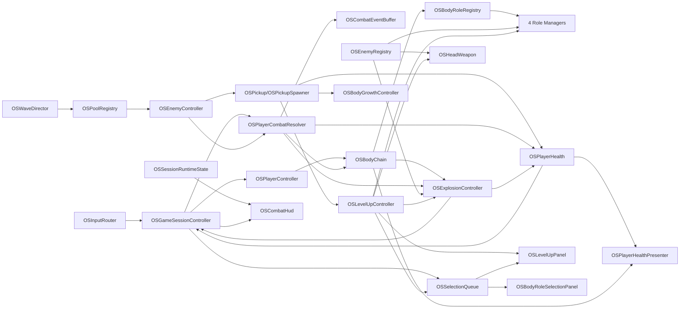

# OUROBOROS: SWARM — Unity 상세 설계서

> 문서 목적: 기존 기획의 핵심인 **몸통 축적 → 유지/절단 위험 → 포위 폭발 → 재성장**을 변경하지 않고, 뱀서류·지렁이류·로그라이트의 장르 문법을 보충하여 Unity 2D에서 바로 구현 가능한 규칙과 구조로 고정한다.
>
> 대상: 기획, 클라이언트 프로그래머, 아트/UI, QA
>
> 제작 전제: 3인 4주 MVP, PC/Windows 및 WebGL, 캐릭터 1종, 맵 1종, 일반 적 4종, 정예 1종, 보스 1종
>
> 표기 규칙: **[확정]**은 현재 구현 기준, **[가설]**은 ScriptableObject에서 조정할 초기값, **[제외]**는 MVP에 넣지 않는 요소다.

---

## 0. 문서 우선순위와 충돌 해소

### 0.1 우선순위

규칙이 충돌할 때 다음 순서로 결정한다.

1. 몸통 축적·방출·재성장이라는 핵심 경험
2. 최신 기능 정의와 동시 이벤트 규칙
3. 3인 4주 MVP 및 PC/Web 성능 범위
4. 초기 밸런스 표
5. 장르 관습

장르 관습은 핵심 경험을 강화할 때만 채택한다. 장르에서 흔하더라도 미로, 영구 장비 파밍, 대량 무기 진화, 자기 몸 충돌 즉사처럼 현재 기획을 다른 게임으로 바꾸는 요소는 넣지 않는다.

### 0.2 확정된 충돌 처리

| 항목 | 구현 기준 | 처리 이유 |
| --- | --- | --- |
| 몸통 최대 길이 | **[확정] 디자인상 제한 없음** | 20칸은 과거 초기 밸런스 관찰값이다. |
| 기술 안전 한도 | **[가설] 활성 세그먼트 + 대기 생성 요청 64** | WebGL 안정성 가드이며 게임 규칙상 최대치로 노출하지 않는다. |
| 포위 폭발 소비율 | **[확정] 현재 활성 몸통의 30%** | 50%는 과거 가설이다. |
| 폭발 소비 칸 계산 | **[가설] `max(1, ceil(N × 0.30))`** | 소수 결과를 명확히 처리한다. |
| 몸통 피격 | **[가설] 피격 세그먼트부터 꼬리까지 절단** | 지렁이형 길이 손실을 명확한 위험으로 만든다. |
| 시작 몸통 | **[가설] 전투 전 역할 4택 2회** | 처음부터 역할 조합을 체험시키되 진입 피로도를 테스트한다. |
| 최대 몸통 +3 업그레이드 | **[제외] P0 후보에서 제거** | 무제한 길이 규칙과 충돌한다. 역할 과충전으로 대체한다. |
| 영구 성장 | **[제외]** | 로그라이트의 런 단위 선택만 사용하고 메타 강화는 P2 이후다. |

### 0.3 절대 유지해야 하는 설계 기둥

- 몸통이 길수록 머리의 지속 화력이 강해진다.
- 몸통은 역할 모듈이자 절단될 수 있는 실제 전투 구조물이다.
- 포위 폭발은 꼬리부터 몸통 일부를 의도적으로 소비한다.
- 폭발은 전장을 비우지만 직후 지속 화력을 낮춘다.
- 플레이어는 다시 몸통을 모아 전력을 재건한다.
- 맵 탐색보다 군집 밀도, 안전 공간, 몸통 상태, 폭발 타이밍을 읽는다.

### 0.4 문서 역할과 갱신

- 이 문서는 현재 적용할 게임 규칙, 수치, 데이터 계약, Unity 구조와 수용 기준의 기준 문서다.
- 실제 구현 진척, 완료 체크, 테스트 실행 결과는 `OUROBOROS_SWARM_구현순서.md`의 관련 Step에 기록한다. 이 문서에 진행률을 중복 기록하지 않는다.
- 구현 중 규칙, 확정 수치, 클래스 책임, 이벤트 순서 또는 수용 기준을 바꾸기로 결정한 경우에는 코드 변경과 같은 작업 묶음에서 이 문서의 관련 절을 갱신한다.
- 구현이 아직 설계와 다르다는 이유만으로 설계 내용을 현재 코드에 맞춰 낮추지 않는다. 차이가 결함인지 의도된 설계 변경인지 먼저 구분한다.
- 문서 갱신의 세부 절차와 `AGENTS.md` 자체 유지 기준은 저장소 루트의 `AGENTS.md`를 따른다.

---

## 1. 장르별 특성 보강

## 1.1 뱀서류: 자동 공격 군집 생존 액션

### 채택할 특성

| 장르 특성 | 본 게임 적용 | 핵심 기획과의 연결 |
| --- | --- | --- |
| 자동 공격 | 머리와 공격형 몸통이 유효 표적을 자동 선정한다. | 플레이어 입력을 이동·포지셔닝·폭발 판단에 집중시킨다. |
| 시간 기반 압박 | 60초 단위로 적 조합을 확장하고 생성 압력을 높인다. | 몸통을 오래 유지할수록 커지는 탐욕과 포위 위험을 만든다. |
| 대량 적 군집 | 개별 AI보다 밀도와 접근 방향을 읽게 한다. | 폭발의 공간 확보 가치를 강화한다. |
| 경험치 수집과 3택 | 레벨업 시 전투를 멈추고 중복 없는 업그레이드 3개 중 하나를 고른다. | 런마다 지속 화력·폭발·생존 비중이 달라진다. |
| 빌드 누적 | 작은 수치 강화가 10분 동안 누적되어 체감 가능한 방향성을 만든다. | 몸통 역할 조합과 일반 업그레이드가 서로 보완된다. |
| 강한 위험 예고 | 돌진, 사격, 레이저, 보스 패턴을 형태·범위·음향으로 예고한다. | 적이 많아도 불합리한 피격 대신 판단 실패가 원인이 되게 한다. |
| 제한 시간과 보스 | 9분 예고, 10분 보스 등장, 처치 시 클리어한다. | 런의 명확한 종착점과 빌드 검증 목표를 제공한다. |

### 추가 설계 원칙

- 자동 공격은 **무대상일 때 쿨다운을 소비하지 않는다**. 적이 다시 들어왔을 때 즉시 반응하게 한다.
- 화면의 적 수가 많아질수록 투사체 수만 늘리기보다 관통, 범위, 폭발, 제어가 의미를 갖게 한다.
- 스폰은 카메라 바깥 고리에서 발생하며 화면 안, 플레이어 근접, 장애물 내부 스폰을 거부한다.
- 경험치·몸통 조각은 서로 대체하지 않는다. 플레이어가 어느 동선을 택했는지에 따라 성장 속도가 달라진다.
- 드롭 오브젝트가 과도하게 쌓이면 같은 종류와 값을 합쳐 개수는 줄이고 총량은 보존한다.
- 20~30초마다 `몸통 생성`, `폭발 가능`, `정예/패턴 대응`, `레벨업` 중 최소 하나의 의미 있는 판단이 발생하도록 웨이브를 조정한다.

### 채택하지 않을 특성

- 화면을 가리는 수십 종 무기와 진화 조합
- 움직이지 않아도 성립하는 방치형 빌드
- 20분 이상 장기 런
- 무작위 선택만으로 승패가 결정되는 희귀도·상자·리롤 경제
- 공격 이펙트가 위험 신호를 덮는 전면 채우기 연출

## 1.2 지렁이/스네이크류: 머리 조작과 길이 자원

### 채택할 특성

| 장르 특성 | 본 게임 적용 | 핵심 기획과의 연결 |
| --- | --- | --- |
| 머리 중심 이동 | 플레이어는 머리 코어만 직접 이동시킨다. | 긴 몸통을 하나의 생체 병기로 느끼게 한다. |
| 경로 추종 | 몸통은 머리가 실제 지나간 경로를 일정 간격으로 따른다. | 길이가 늘어도 제어 규칙이 변하지 않는다. |
| 꼬리 성장 | 새 역할 세그먼트는 현재 꼬리에 추가된다. | 획득한 순서가 공간 배치와 손실 위험으로 남는다. |
| 길이의 즉시 가시화 | 세그먼트 수가 공격력·보조탄·역할 수로 직접 드러난다. | 숫자를 보지 않아도 강함과 잃을 것을 읽게 한다. |
| 부분 손실 | 몸통 피격 시 해당 지점부터 꼬리까지 잘린다. | 머리 HP 피해와 다른 종류의 긴장을 만든다. |
| 꼬리 희생 | 폭발은 꼬리부터 일부를 예약·소비한다. | 축적 자원을 위기 탈출 수단으로 전환한다. |

### 추가 설계 원칙

- 세그먼트 위치는 이전 세그먼트를 단순 추적하지 않고 **누적 거리 기반 경로 샘플**에서 계산한다. 프레임 변동과 긴 체인에서 간격이 무너지는 것을 막는다.
- 자기 몸, 머리와 몸통 사이에는 물리 충돌이 없다. 긴 몸 때문에 길이 자체가 이동 불능 원인이 되지 않게 한다.
- 머리가 통과한 경로만 몸통이 사용하므로 몸통은 장애물 충돌을 별도로 해결하지 않는다.
- 새로 얻은 세그먼트는 꼬리에 있어 폭발 시 먼저 소비된다. 역할 선택 카드에 `꼬리에 추가됨`을 명시한다.
- 절단과 폭발로 사라지는 세그먼트는 역할 문양과 연결선을 꼬리 방향으로 지워 상실 범위를 0.5초 안에 파악하게 한다.
- 체인이 매우 길어도 카메라는 머리를 기준으로 한다. 전체 몸통을 항상 화면에 맞추기 위해 줌아웃하지 않는다.

### 채택하지 않을 특성

- 격자 이동과 강제 전진
- 자기 몸 충돌 즉사
- 벽에 닿으면 즉사
- 먹이만 찾아다니는 탐색 중심 플레이
- 미로와 좁은 통로
- 길이가 점수만 되고 전투 기능은 없는 구조

## 1.3 로그라이트: 한 런 안의 선택과 빌드 형성

### 채택할 특성

| 장르 특성 | 본 게임 적용 | 핵심 기획과의 연결 |
| --- | --- | --- |
| 런 단위 초기화 | 사망·클리어 후 몸통, 레벨, 업그레이드, 적 상태를 모두 초기화한다. | 매 런 축적과 방출의 판단을 다시 검증한다. |
| 통제된 무작위 3택 | 적격 업그레이드 중 3개를 고유하게 제시한다. | 같은 캐릭터도 다른 강화 경로를 갖는다. |
| 빌드 방향 | 지속 화력, 몸통/역할, 폭발, 생존, 유틸 계열을 누적한다. | 몸통 역할 선택과 일반 강화가 결합된다. |
| 상황 적응 | 현재 몸통 조합과 생존 상태에 맞는 선택을 할 수 있다. | 고정 정답 대신 런마다 다른 복구 전략을 만든다. |
| 결과 회고 | 생존 시간, 최대 몸통, 절단 손실, 폭발 처치, 보스 결과를 보여준다. | 다음 런에서 판단을 개선할 근거를 준다. |
| 결정적 QA 시드 | 내부 테스트에서는 런 시드를 기록하고 재현한다. | 물리·선택·웨이브 결함을 반복 검증한다. |

### 추가 설계 원칙

- 무작위성은 **선택 후보**에만 강하게 사용한다. 이동, 피격, 폭발 소비, 역할 상실 결과는 결정적이어야 한다.
- 초반 3레벨의 후보는 공격·몸통·생존 계열이 각각 한 칸 이상 등장하도록 보정한다.
- 최대 단계 도달, 현재 규칙과 충돌, 데이터 오류인 업그레이드는 후보에서 제외한다.
- 런 시드는 결과 데이터에 남기되 사용자 입력형 시드, 일일 도전은 MVP에 넣지 않는다.
- 희귀도, 합성, 리롤, 밴시, 영구 해금은 제외한다. 15종 내외의 작은 카탈로그로 선택의 질을 먼저 검증한다.

### 채택하지 않을 특성

- 영구 능력치 상승과 장비 파밍
- 복잡한 인벤토리와 장비 슬롯
- 절차 생성 미로
- 서사 분기와 다중 엔딩
- 상점, 통화, 재화 회수 경제
- 실패를 반복해야만 기본 성능이 정상화되는 메타 성장

## 1.4 세 장르의 결합 결과

플레이어가 실제로 반복하는 판단은 다음과 같다.

1. 뱀서류 방식으로 자동 공격을 맡기고 이동으로 군집의 빈틈을 만든다.
2. 지렁이류 방식으로 길어진 몸의 경로와 피격 위험을 관리한다.
3. 로그라이트 방식으로 새 몸통 역할과 업그레이드를 선택해 이번 런의 빌드를 만든다.
4. 포위가 완성되기 전에 긴 몸을 유지할지 일부를 폭발로 바꿀지 결정한다.
5. 절단 또는 폭발 후 남은 빌드로 재성장 동선을 만든다.

장르 결합의 성공 기준은 장르 요소가 따로 노는 것이 아니라 **몸통을 얼마나 쌓고 언제 잃을 것인가**라는 하나의 질문으로 수렴하는 것이다.

---

## 2. 게임 목표와 세션 구조

## 2.1 한 줄 목표

넓은 2D 필드에서 자동 공격과 자유 이동으로 군집 감염체를 처치하고 역할형 몸통을 늘린 뒤, 필요할 때 꼬리를 폭발로 소비하며 10분 보스를 격파한다.

## 2.2 승리·패배

| 결과 | 조건 | 처리 |
| --- | --- | --- |
| 클리어 | 10:00에 등장한 보스 `군집핵`의 HP가 0 | 전투 정지, 결과 확정, 클리어 패널 표시 |
| 사망 | 머리 코어 HP가 0 이하 | 즉시 모든 후속 전투 이벤트 취소, 결과 패널 표시 |
| 시간 초과 | **[확정] 보스 등장 후 전투 시간 90초가 경과** | 실패 결과로 종료; 선택 상태에서는 제한 시간이 정지 |
| 재시작 | 결과 화면에서 재시작 | 같은 씬에서 새 런타임 상태·새 시드·초기 풀 상태로 세션 재구성 |

## 2.3 세션 타임라인

| 구간 | 시간 | 플레이 목표 | 주요 압박 | 시스템 목표 |
| --- | ---: | --- | --- | --- |
| 시작 선택 | 세션 타이머 전 | 시작 몸통 역할 2개 선택 | 없음 | 조작 전 빌드 정체성 제공 |
| 도입 | 0:00~1:30 | 이동, 자동 공격, 첫 조각·레벨업 이해 | 추적체 중심 | 설명 없이 기본 조작 이해 |
| 성장 | 1:30~3:00 | 몸통 4칸 이상, 첫 폭발 경험 | 돌진체 추가 | 유지/소비의 첫 고민 발생 |
| 정예 1 | 3:00 전후 | 정예 대응, 역할 조합 확인 | 가속 오라 | 집중 공격과 공간 확보 학습 |
| 분기 | 3:00~6:00 | 지속 화력·폭발·제어 비중 형성 | 사격체·분열체 추가 | 서로 다른 빌드가 성립 |
| 정예 2 | 6:00 전후 | 손실 후 재구성 | 복합 군집 | 절단/폭발 후 회복성 검증 |
| 한계 | 6:00~9:00 | 긴 몸의 위험과 최대 밀도 대응 | 고밀도 혼합 웨이브 | 판독성과 성능 피크 검증 |
| 보스 예고 | 9:00~10:00 | 보스 전 몸통·HP 재정비 | 소환 압박 | 마지막 선택과 폭발 보존 판단 |
| 결전 | 10:00~최대 11:30 | 축적과 폭발을 교대로 사용 | 군집핵 패턴 | 전체 빌드의 최종 검증 |

## 2.4 핵심 지표

- 첫 플레이 60초 이내 이동과 자동 공격 이해율
- 첫 폭발까지 걸린 시간
- 폭발 평균 사용 간격: **[가설] 35~50초**
- 폭발 1회 평균 처치 수: **[가설] 15~30마리**
- 평균·최대 몸통 수와 절단으로 잃은 수
- 몸통 역할 선택 분포와 꼬리 소비로 사라진 역할 분포
- 3분·6분 정예 도달률
- 첫 플레이 생존 4~6분, 세 번째 플레이 보스 도달 목표
- 지속 화력 중심과 반복 폭발 중심 빌드의 보스 처치 시간 차이 20% 이내

---

## 3. 입력, 카메라, 전장

## 3.1 입력

Unity **New Input System**만 사용한다.

| Action Map / Action | 타입 | 기본 입력 | 유효 상태 | 규칙 |
| --- | --- | --- | --- | --- |
| `Player/Move` | Value / Vector2 | WASD, 방향키 | Combat, ExplosionTelegraph | 크기 1로 제한하고 대각선 속도를 정규화한다. |
| `Player/Explosion` | Button / Press | Space | Combat | 조건을 한 번 판정하며 예고 중 재입력은 무시한다. |
| `UI/Point`, `UI/Click` | Pointer | 마우스 | 선택·결과 | 카드 포커스·확정 |
| `UI/Navigate`, `UI/Submit` | Vector2 / Button | 방향키, Enter | 선택·결과 | 키보드만으로 모든 선택 가능 |
| `UI/Cancel` | Button | Escape | 메뉴/결과 | 몸통·레벨업 선택은 취소 불가; 일시 메뉴는 P1 |

- 선택 상태에서는 Player Map을 끄고 UI Map만 켠다.
- Map 전환 시 이동·폭발 버퍼를 비우며 복귀 후 예약 실행하지 않는다.
- 게임패드와 리바인딩은 P1이다.

## 3.2 이동

- 머리 코어는 입력 방향으로 초당 **[가설] 5.5** 이동한다.
- `Move`가 0이면 정지하고 마지막 유효 이동 방향을 유지한다.
- 머리 이동은 `Rigidbody2D.Cast` 또는 `Collider2D.Cast`로 장애물을 검사한 뒤 접선 방향으로 미끄러지게 한다.
- 적과 플레이어는 물리적으로 서로 밀지 않는다. 접촉 피해는 Trigger 이벤트로만 수집한다.
- 머리와 몸통, 몸통끼리는 충돌하지 않는다.
- 몸통의 사격 조준은 이동 방향과 독립적이다.

## 3.3 카메라

- 카메라는 머리 코어를 추종하며 회전하지 않는다.
- 긴 몸통 전체를 담기 위한 자동 줌아웃은 사용하지 않는다.
- 부드러운 추종 지연은 **[가설] 0.08~0.15초** 범위에서 조정한다.
- 위험 예고가 화면 가장자리에서 잘리지 않도록 카메라 여백 안쪽에 최소 표시 아이콘을 제공한다.
- 화면 흔들림은 폭발·보스 강공격에만 짧게 사용하고 옵션으로 강도를 낮출 수 있게 한다.

## 3.4 전장

- 단일 넓은 필드, 드문 장애물 6~10개를 사용한다.
- 장애물은 좁은 미로를 만들지 않고, 플레이어 머리와 적만 막으며 투사체는 통과한다.
- 통로 최소 폭은 머리 지름의 **[가설] 3배 이상**으로 유지한다.
- 화면 중앙을 장기간 가리는 대형 장애물은 배치하지 않는다.
- 월드 경계는 카메라보다 충분히 넓게 두고, 머리가 경계를 넘지 못하도록 이동을 제한한다.

---

## 4. 플레이어와 몸통 시스템

## 4.1 머리 코어

| 항목 | 초기값 | 비고 |
| --- | ---: | --- |
| 최대 HP | 100 | [가설] |
| 이동 속도 | 5.5/s | [가설] |
| 피격 무적 | 0.6초 | 머리 HP 피해만 방지 |
| 기본 공격 피해 | 10 | 몸통 길이 배율 적용 |
| 기본 발사 빈도 | 초당 2발 | 주기 0.5초 |
| 기본 사거리 | 6 | 월드 단위 |
| 기본 자석 반경 | 1.25 | [가설], 유틸 업그레이드 대상 |

## 4.2 몸통 정의

- `현재 몸통 수`는 머리를 제외한 활성 세그먼트 수다.
- 대기 중 생성 요청은 현재 몸통 수, 머리 화력, 폭발 계산에 포함하지 않는다.
- 역할은 실드, 공격, 레이저, 제어 4종이다.
- 역할 데이터 ID는 각각 `shield`, `attack`, `laser`, `control`을 사용한다.
- 새 세그먼트는 역할 선택 확정 후 현재 꼬리에 1개 추가된다.
- 세그먼트는 안정적인 런타임 ID, 체인 인덱스, 역할, Transform, Collider, View 상태를 가진다.
- 역할별 전투 로직은 세그먼트 개별 Update에 흩뿌리지 않고 역할 관리자에 등록한다.

## 4.3 경로 추종 알고리즘

### 데이터

```text
PathSample
- position: Vector2
- cumulativeDistance: float
- forward: Vector2
```

### 규칙

1. 머리가 `pathSampleInterval` 이상 이동할 때마다 경로 샘플을 원형 버퍼에 기록한다.
2. 세그먼트 `i`의 목표 누적 거리는 머리 최신 샘플에서 `(i + 1) × segmentSpacing`만큼 과거다.
3. 목표 거리 양쪽의 샘플을 찾아 선형 보간하여 위치와 방향을 계산한다.
4. 머리가 멈춰도 기존 샘플을 유지하므로 체인이 수축하거나 겹치지 않는다.
5. 시작 시 경로 길이가 부족하면 마지막 방향의 반대쪽으로 가상 직선 샘플을 만든다.
6. 가장 오래된 필요 거리보다 이전 샘플만 버린다.

### 초기 조정값

| 항목 | 값 | 목적 |
| --- | ---: | --- |
| `segmentSpacing` | 0.55 | [가설] 세그먼트 시각 간격 |
| `pathSampleInterval` | 0.12 | [가설] 회전 재현 정밀도 |
| 경로 여유 거리 | 4.0 | 급회전·생성 직후 안정화 |
| 기술 세그먼트 가드 | 64 | 풀·경로 버퍼 산정 기준 |

### 구현 주의

- 매 프레임 `List.Insert(0)`를 사용하지 않는다. 고정 배열 원형 버퍼를 사용한다.
- 거리 탐색은 이전 프레임 인덱스를 캐시하거나 머리부터 꼬리 방향으로 한 번 순회한다.
- `Vector2.Distance`를 반복 호출하지 않고 누적 거리와 제곱 거리를 활용한다.
- 세그먼트 Transform은 FixedUpdate에서 계산하고 렌더 보간이 필요하면 View만 LateUpdate에서 보간한다.

## 4.4 몸통 획득

- 몸통 조각 픽업 1개는 게이지 1을 제공한다.
- 게이지가 12 이상이면 12를 차감하고 몸통 생성 요청 1건을 큐에 넣는다.
- 한 번에 여러 기준을 넘으면 요청을 여러 건 만든다.
- 폭발 예고 중에는 요청만 큐에 저장하고 선택 UI를 열지 않는다.
- 활성 세그먼트와 대기 요청 합이 64에 도달하면 게이지를 12 충족 상태로 보류하고 추가 조각을 누적하지 않는다.
- 절단·폭발로 여유가 생기면 보류된 요청 1건을 즉시 생성한다.

## 4.5 역할 선택

- 선택지는 항상 실드·공격·레이저·제어 4개를 모두 표시한다.
- 랜덤 추출, 중복 제한, 취소, 시간 제한은 없다.
- 카드는 현재 보유 역할 수, 새 세그먼트가 꼬리에 추가된다는 점, 핵심 효과를 표시한다.
- 선택 확정 전투는 완전히 정지한다.
- 요청이 여러 건이면 한 건씩 연속 처리한다.
- 몸통 요청과 레벨업 요청이 동시에 있으면 몸통 역할 선택을 모두 먼저 처리한다.

## 4.6 몸통 길이 공통 화력

활성 몸통 수를 `L`이라고 할 때:

```text
HeadDamage = BaseHeadDamage × RuntimeHeadDamageMultiplier × (1 + L × BodyDamageRate)
BodyDamageRate = 0.04 + upgradeBonus
AuxProjectileCount = floor(L / 5)
TotalHeadProjectileCount = 1 + AuxProjectileCount
```

- 기본 `BodyDamageRate`는 칸당 4%다.
- 모든 머리 투사체는 같은 발사 시점과 표적을 사용한다.
- 보조 투사체가 같은 위치에서 완전히 겹치지 않도록 발사 각도를 **[가설] ±4도 간격**으로 분산한다.
- 보조 투사체도 기본 머리 투사체와 같은 피해를 갖는다.
- 공격·레이저·제어 역할 수치에는 공통 길이 배율을 적용하지 않는다.
- 생성·절단·폭발 소비 직후 다음 머리 발사부터 새 길이를 사용한다.

## 4.7 몸통 피격과 절단

- 몸통 피격은 머리 HP를 감소시키지 않는다.
- 피격 세그먼트 인덱스 `i`부터 현재 꼬리까지 모두 제거한다.
- 같은 FixedUpdate에 여러 몸통 피격이 있으면 머리에 가장 가까운 인덱스 하나만 적용한다.
- 유효 절단 후 전체 몸통에 **[가설] 0.35초** 연속 절단 방지를 적용한다.
- 절단 방지는 머리 피해를 막지 않는다.
- 머리 무적은 몸통 절단을 막지 않는다.
- 절단된 세그먼트는 픽업으로 변환되지 않는다.
- 절단 시 역할 관리자 등록 해제, 폭발 예약 제거, 공통 화력 갱신, HUD 갱신을 하나의 원자 처리로 수행한다.

## 4.8 동일 공격의 머리·몸통 중복

- 한 공격 이벤트가 머리와 몸통 콜라이더에 동시에 닿으면 머리 피격 후보 1건만 남긴다.
- 서로 다른 공격 이벤트가 같은 틱에 머리와 몸통을 각각 맞히면 머리 피해를 먼저 처리한다.
- 머리 피해로 사망하면 그 틱의 몸통 절단, 폭발 완료, 픽업, 선택 요청은 처리하지 않는다.

---
## 5. 전투 시스템

## 5.1 머리 자동 공격과 표적 선정

### 발사 절차

1. 발사 가능한 상태인지 확인한다.
2. 발사 주기가 도달했는지 확인한다.
3. `OSEnemyRegistry`의 활성 적 목록을 비할당 순회한다.
4. 사거리 안의 생존 적 중 가장 가까운 적을 선정한다.
5. 거리 동률이면 기존 표적을 유지한다.
6. 기존 표적이 없으면 안정 런타임 ID가 작은 적을 고른다.
7. 정예 우선 업그레이드가 있으면 정예·보스를 일반 적보다 먼저 비교한다.
8. 투사체 풀 대여가 성공한 경우에만 발사 주기를 갱신한다.

### 무대상·풀 포화

- 유효 표적이 없으면 발사하지 않고 주기를 소비하지 않는다.
- 투사체 풀이 포화되면 존재하지 않는 탄의 피해를 만들지 않는다.
- 포화 로그는 동일 종류당 제한적으로 기록하고 프레임마다 출력하지 않는다.

## 5.2 역할형 몸통

모든 역할 수치는 초기 가설이며 `OSBodyBalanceData`에서 조정한다.

### 실드 몸통

| 항목 | 규칙 |
| --- | --- |
| 범위 | 세그먼트 중심 반경 1.5 |
| 충전 | 세그먼트당 1회 |
| 방어 대상 | 범위 내 머리 HP 피해 또는 몸통 절단을 만들 유효 적대 피격 1건 |
| 재충전 | 전투 시간 6초 |
| 중첩 | 피격점과 가장 가까운 충전 실드 1개만 소비; 동률이면 머리에 가까운 세그먼트 우선 |
| 제거 | 절단·폭발 시 범위, 충전, 재충전 타이머 즉시 제거 |

- 이미 머리 무적이나 절단 방지로 무효인 피격에는 충전을 사용하지 않는다.
- 실드 범위는 색뿐 아니라 원형 문양과 외곽 링으로 표시한다.
- 재충전 중 링이 비고, 충전 완료 시 짧은 음향과 점등을 사용한다.

### 공격 몸통

| 항목 | 규칙 |
| --- | --- |
| 사거리 | 6 |
| 피해 | 6 |
| 주기 | 1초 |
| 표적 | 해당 세그먼트 기준 가장 가까운 적 |
| 중첩 | 세그먼트별 독립 발사; 같은 적 동시 공격 가능 |
| 제거 | 새 발사 중지; 이미 발사된 탄은 수명까지 유지 |

### 레이저 몸통

| 항목 | 규칙 |
| --- | --- |
| 사거리/길이 | 7 |
| 피해 | 12 |
| 주기 | 2.5초 |
| 폭 | 0.35 |
| 예고 | 0.2초, 실제 판정과 같은 시작점·방향·폭·길이 |
| 판정 | 선상 고유 적마다 1회 관통 피해 |
| 제거 | 예고 중 제거되면 해당 레이저 취소 |

- 예고 시작 시 시작 위치와 방향을 스냅샷으로 저장한다.
- 발사 시점에 소스 세그먼트 생존 여부를 다시 확인한다.
- 한 광선 내부에서 여러 Collider가 잡힌 같은 적은 런타임 ID로 중복 제거한다.

### 제어 몸통

| 항목 | 규칙 |
| --- | --- |
| 사거리 | 6 |
| 피해 | 0 |
| 주기 | 4초 |
| 일반 적 이동 불가 | 1초 |
| 정예·보스 이동 불가 | 0.5초 |
| 재적용 | 남은 시간과 새 지속 시간 중 큰 값으로 교체; 합산하지 않음 |
| 제거 | 새 발사 중지; 이미 발사된 탄과 적용된 제어는 유지 |

- 제어탄의 Damage 값은 반드시 0으로 검증한다.
- 적 공격·애니메이션까지 멈출지는 적 데이터의 `controlAffectsAttack`로 분리한다.
- 보스의 핵심 패턴은 제어로 취소하지 않고 이동 속도만 제한하는 것이 기본이다.

## 5.3 포위 폭발

### 발동 조건

- 세션 상태가 `Combat`이다.
- 현재 활성 몸통이 4칸 이상이다.
- 선택, 사망, 클리어, 다른 폭발 예고 상태가 아니다.

### 계산

입력 시 활성 몸통 수를 `N`이라고 할 때:

```text
K = max(1, ceil(N × 0.30))
```

꼬리부터 `K`개의 안정 ID와 현재 월드 위치를 예약한다.

### 예고

- 예고 시간: **[가설] 0.25초**
- 예약 세그먼트의 고정 위치마다 반경 **[가설] 1.8** 원을 표시한다.
- 전체 예약 수와 예상 소비 후 남는 몸통 수를 HUD에 표시한다.
- 예고 중 이동, 머리 자동 공격, 역할 효과, 피격, 절단은 계속된다.
- 예고 중 새 몸통·레벨업 요청은 큐에만 저장한다.

### 완료

1. 같은 틱의 머리 피해와 몸통 절단을 먼저 확정한다.
2. 절단으로 사라진 예약 ID를 제외한다.
3. 남은 예약 수를 `A`라고 한다.
4. `A = 0`이면 피해·소비·무적 없이 취소한다.
5. 예약 위치 원들의 합집합 안에 있는 생존 적 ID를 수집한다.
6. 각 고유 적에게 `A × 35` 피해를 1회 적용한다.
7. 같은 원자 처리에서 남은 예약 세그먼트 `A`개를 제거한다.
8. 머리에 **[가설] 0.4초** 폭발 무적을 적용한다.
9. 대기 선택이 있으면 몸통 역할 선택부터 연다.

### 예시

| 입력 시 몸통 N | 예약 K | 절단 없음 시 실제 A | 적 1개당 피해 |
| ---: | ---: | ---: | ---: |
| 3 | 발동 불가 | 0 | 0 |
| 4 | 2 | 2 | 70 |
| 5 | 2 | 2 | 70 |
| 10 | 3 | 3 | 105 |
| 20 | 6 | 6 | 210 |
| 64 | 20 | 20 | 700 |

### 폭발의 장르적 역할

- 뱀서류: 고밀도 군집을 지우는 광역 탈출기
- 지렁이류: 길이 일부를 실제로 희생하는 꼬리 절단
- 로그라이트: 폭발 강화 투자와 지속 화력 손실 사이의 빌드 선택

### 금지 사항

- 원이 겹친 횟수만큼 같은 적에게 중복 피해를 주지 않는다.
- 역할 종류에 따라 소비 우선순위를 바꾸지 않는다.
- 예고 중 새로 얻은 몸통을 현재 폭발에 포함하지 않는다.
- 조건 불충족 입력으로 몸통·쿨다운·예약을 소비하지 않는다.
- 폭발을 화면 정리용 연출로만 처리하고 실제 빈 공간이 생기지 않는 웨이브를 만들지 않는다.

## 5.4 머리 HP와 사망

- 유효 머리 피격만 HP를 감소시킨다.
- 피격 후 0.6초 동안 머리 피해를 무시한다.
- 폭발 무적과 피격 무적은 출처별 만료 시각을 보관하고 둘 중 하나라도 유효하면 머리 피해를 막는다.
- 무적 중 피격은 HP, 무적 시간, 실드 충전을 변경하지 않는다.
- 회복은 최대 HP를 넘지 않는다.
- HP가 0 이하이면 즉시 `Dead`로 전이한다.
- 사망 틱의 후속 절단, 폭발 완료, 픽업, 레벨업, 역할 선택은 취소한다.

---

## 6. 픽업, 경험치, 성장

## 6.1 픽업 종류

| 종류 | 효과 | 진행도 |
| --- | --- | --- |
| 경험치 | 런 경험치 증가 | 레벨 요구량 도달 시 LevelUp 요청 |
| 몸통 조각 | 몸통 게이지 증가 | 12마다 Body 요청 |
| 회복 | 머리 HP 회복 | 최대 HP 제한 |

- 모든 픽업은 머리의 수집 콜라이더만 수집한다.
- 픽업은 자석 반경 밖에서는 정지 또는 짧은 드롭 이동만 하고, 반경 안에서 머리로 가속한다.
- 선택 상태에서는 픽업 이동과 수집을 정지한다.

## 6.2 픽업 병합

뱀서류 장르의 대량 드롭을 WebGL에서도 유지하기 위해 같은 종류 픽업을 병합한다.

1. 새 픽업 생성 요청 시 근처의 활성 같은 종류 픽업을 검색한다.
2. **[가설] 1.5 반경** 안에 있으면 해당 픽업의 `amount`를 증가시킨다.
3. 없으면 풀에서 새 픽업을 대여한다.
4. 풀이 포화되면 가장 가까운 같은 종류 픽업에 거리를 무시하고 값을 합친다.
5. 값은 보존하고 GameObject 수만 줄인다.

Step 12 기준 경험치·몸통 조각·회복은 세션 전 256개를 만든 공용 `body_fragment_pickup` 풀을 사용한다. 풀 키는 구현 호환을 위해 유지하되 각 인스턴스는 `OSPickupType`으로 효과·병합 대상을 구분하고 경험치/조각/회복 색상을 다르게 표시한다.

## 6.3 경험치 요구량

```text
RequiredXP(level 1) = 15
RequiredXP(next) = ceil(previous × 1.18)
```

- 한 번의 수집으로 여러 레벨을 넘으면 LevelUp 요청을 여러 건 생성한다.
- 경험치 초과분은 보존한다.
- 레벨업 선택 중 세션·웨이브·역할·픽업 시간은 정지한다.

## 6.4 업그레이드 카탈로그

모든 수치는 초기 가설값이다. 총 15종으로 유지한다.

| ID | 계열 | 이름 | 1단계 효과 | 최대 단계 | 구현 메모 |
| --- | --- | --- | --- | ---: | --- |
| `head_damage` | 지속 화력 | 코어 과출력 | 머리 피해 +15% | 3 | 런타임 배율에 합연산 후 최종 곱 |
| `head_rate` | 지속 화력 | 신경 가속 | 머리 발사 속도 +12% | 3 | 주기 하한 0.15초 |
| `head_pierce` | 지속 화력 | 관통 탄두 | 머리 탄 관통 +1 | 3 | 동일 적 중복 명중 금지 |
| `body_fragment_efficiency` | 몸통 | 증식 효율 | 조각 요구량 -10% | 2 | 최소 요구량 8 |
| `body_damage_rate` | 몸통 | 연결 증폭 | 칸당 머리 피해 +1%p | 2 | 4% → 최대 6% |
| `role_overclock` | 몸통 | 역할 과충전 | 역할 주기·실드 재충전 -8% | 3 | 최소 주기/재충전 가드 적용 |
| `explosion_radius` | 폭발 | 파동 확장 | 폭발 반경 +15% | 3 | 원별 반경 배율 |
| `explosion_damage` | 폭발 | 연쇄 과부하 | 칸당 폭발 피해 +20% | 3 | 35에 곱연산 |
| `explosion_efficiency` | 폭발 | 조직 보존 | 소비율 -5%p | 3 | 최저 15%, 올림 유지 |
| `max_health` | 생존 | 코어 강화 | 최대 HP +20%, 증가분만큼 회복 | 2 | 현재 HP도 같은 절대량 증가 |
| `move_speed` | 생존 | 유연 신경망 | 이동 속도 +8% | 2 | 상한 7.5/s [가설] |
| `heal_amount` | 생존 | 재생 조직 | 회복 획득량 +25% | 2 | 최대 HP 제한 |
| `magnet_radius` | 유틸 | 수집장 확장 | 자석 반경 +30% | 2 | 픽업 수집만 영향 |
| `experience_gain` | 유틸 | 학습 동기화 | 경험치 획득 +10% | 2 | 몸통 조각에는 영향 없음 |
| `elite_priority` | 유틸 | 위협 식별 | 머리 공격이 정예·보스를 우선 | 1 | 역할 공격은 기존 최근접 유지 |

### 후보 생성 규칙

1. 현재 최대 단계 미만이고 세션 규칙과 충돌하지 않는 항목만 적격이다.
2. 후보 3개는 ID가 서로 달라야 한다.
3. 레벨 1~3에서는 각 화면에 지속 화력, 몸통, 생존 계열을 각각 1개씩 배치한다.
4. 레벨 4 이후에는 계열별 기본 가중치와 현재 보유 단계에 따라 추출한다.
5. 같은 계열을 이미 많이 선택했더라도 완전히 배제하지 않는다.
6. 후보 생성과 확정에는 런 시작 시 확정된 `OSRunRandom`(`System.Random`)만 사용한다. 같은 시드와 같은 선택 이력은 같은 후보 순서를 만들며 시드는 결과에 기록한다.
7. 후보와 단계는 `OSUpgradeCatalog` 원본을 수정하지 않는 런타임 복사본에서 계산한다.
8. 후보가 3개 미만이면 설정 오류로 처리한다. P0에서는 리롤·대체 보상을 만들지 않는다.

## 6.5 빌드 방향

| 빌드 | 주 강화 | 몸통 역할 경향 | 강점 | 약점 |
| --- | --- | --- | --- | --- |
| 지속 화력 | 머리 피해·속도·관통, 몸통 칸당 배율 | 공격·레이저 | 평상시 처치와 보스 DPS | 긴 몸 유지 의존, 절단 손실 큼 |
| 반복 방출 | 폭발 범위·피해·소비 효율, 조각 효율 | 제어·실드 혼합 | 군집 정리와 공간 회복 | 폭발 후 단일 대상 DPS 저하 |
| 안전 재건 | 이동·HP·회복·자석·역할 과충전 | 실드·제어 | 절단/폭발 후 회복 안정 | 순간 처치력 부족 |
| 혼합 | 각 계열 1~2개 | 상황별 혼합 | 런 선택에 유연 | 최고점은 전문 빌드보다 낮음 |

빌드는 UI에서 직업처럼 강제하지 않는다. 결과 화면에서 선택 분포를 요약해 플레이어가 스스로 방향을 인지하게 한다.

---

## 7. 적, 웨이브, 정예, 보스

## 7.1 공통 적 규칙

- 적은 `OSEnemyRegistry`에 활성 등록되어 자동 공격과 역할 시스템의 표적 후보가 된다.
- 적끼리 물리 충돌하지 않는다. 단순 분리 조향으로 완전 중첩만 완화한다.
- 이동·공격·피격·제어·사망·드롭을 데이터 기반 상태로 관리한다.
- 모든 공격은 안정 공격 이벤트 ID를 갖는다.
- 적 사망은 한 번만 확정하고 드롭·풀 반환 이벤트를 중복 발행하지 않는다.
- 화면 밖 적도 규칙상 존재하지만, 너무 멀어진 적은 스폰 디렉터가 안전 위치로 재배치하거나 풀 반환한다.
- **[확정]** Step 13에서 실제 `OSWaveDirector`가 시간표와 스폰 티켓을 소유하며 Step 10 G0의 고정 12마리 `OSEnemyDebugSpawner`는 비활성화한다. 추적체 몸통 조각 드롭 확률 25% 가설은 플레이테스트 결론 전까지 유지한다.

## 7.2 일반 적 4종 초기 가설

| ID | 유형 | 기본 역할 | 초기 HP | 속도 | 공격 | 텔레그래프 | 대응 |
| --- | --- | --- | ---: | ---: | --- | --- | --- |
| `enemy_chaser` | 추적체 | 지속 압박 | 18 | 2.1 | 접촉 8 | 몸 방향만 표시 | 이동하며 자동 사격 |
| `enemy_charger` | 돌진체 | 진형 붕괴 | 42 | 1.6 | 돌진 14 | 0.65초 직선 예고 | 측면 회피, 제어 |
| `enemy_shooter` | 사격체 | 공간 제한 | 32 | 1.4 | 느린 탄 10 | 발사점 점등 0.45초 | 우선 처치, 관통 |
| `enemy_splitter` | 분열체 | 밀도 증가 | 36 | 1.5 | 접촉 7 | 사망 균열 표시 | 폭발 연쇄, 레이저 |

- 분열체는 사망 시 `enemy_splitter_spawn` 소형 적 2개를 만든다. 소형 적은 추가 분열하지 않는다.
- 초기 수치는 플레이테스트용이며 시간 배율 적용 전 값이다.

## 7.3 정예체

| 항목 | 초기 가설 |
| --- | --- |
| ID | `enemy_elite_accelerator` |
| 기본 HP | 650 |
| 이동 속도 | 1.8 |
| 접촉 피해 | 16 |
| 오라 반경 | 4.5 |
| 주변 일반 적 이동 속도 | +20% |
| 주변 일반 적 공격 주기 | -10% |
| 등장 | 3:00, 6:00 |
| 드롭 | 경험치 묶음, 몸통 조각 보장 수량 [SO] |

- 오라는 색만이 아니라 파동 링과 영향을 받는 적의 문양으로 표시한다.
- 같은 정예 오라는 중첩하지 않고 가장 강한 값만 적용한다.
- 정예 우선 업그레이드가 있으면 머리 공격 표적군에서 먼저 선정한다.

## 7.4 웨이브 디렉터

### 시간 배율

```text
EnemyHealthMultiplier(minute) = 1.12 ^ minute
SpawnRateMultiplier(minute) = 1.15 ^ minute
```

**[확정]** Step 13 런타임은 `elapsedSeconds / 60`을 지수로 사용해 두 배율을 연속 적용한다. `OSWaveScheduleData`와 `OSEncounterBalanceData` 원본은 수정하지 않고 세션별 런타임 복사본과 스폰 시점 HP에만 반영한다.

### 스폰 위치

- 카메라 가시 영역 바깥의 고리에서 생성한다.
- 플레이어 머리와 최소 **[가설] 7** 이상 떨어져야 한다.
- 장애물 내부와 월드 경계 밖은 거부한다.
- 최대 8회 후보를 시도하고 실패하면 해당 스폰 티켓을 다음 틱으로 넘긴다.
- 보스·정예는 전용 예고 위치를 사용한다.
- Step 13 정예는 카메라 밖 검증을 통과한 위치와 전용 HUD 경고를 함께 사용한다. **[확정]** Step 14에서 10:00 이벤트는 `OSBossEncounterController`를 통해 `boss_swarm_core` 전용 풀 1칸을 결정적 위치에 1회 생성한다.

### 활성 상한

| 객체 | 1차 상한 |
| --- | ---: |
| 적 전체 | 180 |
| 적·플레이어 투사체 합 | 120 |
| 몸통 활성+대기 | 64 |
| 픽업 GameObject | 256 [가설] |
| 전투 VFX | 160 [가설] |

상한은 기존 객체를 삭제하지 않고 새 생성만 안전하게 거부하거나 병합한다.

## 7.5 분 단위 조합

| 시간 | 신규 요소 | 목표 화면 상태 |
| ---: | --- | --- |
| 0~1분 | 추적체 | 빈 공간이 충분하고 이동 학습 가능 |
| 1~2분 | 돌진체 소량 | 직선 예고를 보고 방향 전환 |
| 2~3분 | 사격체 소량 | 우선 표적과 탄 사이 동선 판단 |
| 3분 | 정예 1 | 오라 중심 군집을 끊거나 폭발 |
| 3~4분 | 추적+돌진+사격 | 첫 혼합 압박 |
| 4~5분 | 분열체 추가 | 군집 밀도와 광역 가치 상승 |
| 5~6분 | 모든 일반 적 | 빌드 분기 검증 |
| 6분 | 정예 2 | 절단/폭발 후 재성장 시험 |
| 6~8분 | 고밀도 혼합 | 활성 적 150 전후 판독성 시험 |
| 8~9분 | 돌진·사격 비율 상승 | 단순 원형 회피 방지 |
| 9~10분 | 보스 예고 웨이브 | HP·몸통·폭발 보존 선택 |
| 10분 이후 | 보스 + 제한 소환 | 보스 패턴과 군집 동시 대응 |

## 7.6 보스: 군집핵

### 공통

| 항목 | Step 14 확정 계약 |
| --- | ---: |
| ID | `boss_swarm_core` |
| HP | **[확정] 6,000** |
| 제한 시간 | **[확정] 전투 시간 90초**; 선택 중 정지 |
| 보호막 HP | **[확정] 600** |
| 이동 | 느린 추적 + 패턴 위치 보정 |
| 제어 | 이동 제한 0.5초, 패턴 캐스팅 취소 없음 |
| 소환 상한 | 일반 적 180 상한 안에서만 생성; 보스는 별도 1칸 |

### 패턴

| 패턴 | 예고 | 효과 | 플레이 대응 |
| --- | --- | --- | --- |
| 흡인 펄스 | 중심 링 0.8초 | 머리를 충돌 안전 이동으로 중심 쪽 2.2만큼 당김 | 외곽 이동, 폭발로 소환 정리 |
| 부채꼴 탄 | 방향 부채 0.6초 | 1·2페이즈 5발, 3페이즈 7발의 피해 14 탄 | 부채 사이 이동 |
| 군집 소환 | 외곽 링 0.8초 | 1·2페이즈 추적·분열체 6마리, 3페이즈 8마리 | 관통·레이저·폭발 |
| 보호막 | 코어 외곽막 0.5초 | 600 HP를 다시 채워 본체보다 먼저 피해 흡수 | 몸통 유지로 지속 파괴 후 본체 공격 |

### 페이즈

- 100~70%: 부채꼴 탄과 소환, 패턴 간격 4.0초
- 70~35%: 흡인 펄스를 추가하고 패턴 간격 3.4초
- 35~0%: 보호막을 추가하고 부채꼴 7발·소환 8마리·패턴 간격 2.8초; 화면 고위험 예고는 최대 1개

보스는 폭발만 정답이거나 지속 화력만 정답이 되지 않게 한다. 폭발은 소환 군집과 공간 회복에 강하고, 유지한 몸통은 보호막과 본체 DPS에 강하도록 역할을 나눈다.

**[확정]** `OSBossEncounterController`는 플레이어 피해 확정과 폭발 처리 뒤에 보스 사망을 판정한다. 같은 틱에 플레이어와 보스가 모두 사망하면 플레이어 사망이 우선하며 별도 동시 승리는 없다. 보스 처치, 플레이어 사망, 90초 시간 초과는 각각 구분되는 결과 종류로 런 요약에 고정한다.

---
## 8. UI, 튜토리얼, 피드백

## 8.1 전투 HUD

| 요소 | 위치 | 표시 내용 | 갱신 원천 |
| --- | --- | --- | --- |
| HP | 좌상단 | 현재/최대, 무적 점멸 | `HealthChanged` |
| 몸통 | HP 아래 | 현재 몸통 수, 4역할 개수, 조각 `현재/요구량` | `ChainChanged`, `RuntimeStateChanged` |
| 폭발 | 몸통 영역 | 사용 가능 여부, 예상 소비 수, 예고 중 실제 잔존 예약 수 | `ExplosionStarted/ReservationChanged` |
| 경험치 | 상단 | 레벨, 현재/요구량 | `RuntimeStateChanged` |
| 타이머 | 상단 중앙 | 세션 시간, 정예·보스 예고 | `SessionClockChanged` |
| 보스 HP | 상단 하단 | 본체/보호막 | `BossStateChanged` |
| 역할 상태 | 몸통 HUD 또는 월드 | 실드 충전, 제어 지속, 레이저 예고 | 역할 이벤트 |

- 무제한 길이이므로 `현재/최대 몸통` 표시는 사용하지 않는다.
- 기술 안전 한도 64를 HUD 최대치로 노출하지 않는다.
- 역할 세그먼트는 색 외에 실루엣, 문양, 발사 형태 중 2개 이상으로 구분한다.
- 적 150마리 상황에서도 머리 코어, 위험 공격, 경험치, 폭발 예약이 구분되어야 한다.

## 8.2 몸통 역할 4택

카드에는 다음을 표시한다.

- 역할 이름과 고유 문양
- 한 문장 효과
- 현재 보유 수
- 주요 수치: 범위/피해/주기/제어 시간 중 필요한 것
- `꼬리에 추가` 라벨
- 폭발로 꼬리부터 소비된다는 보조 설명은 첫 1회만 노출

키보드 포커스는 왼쪽부터 실드→공격→레이저→제어 순서로 고정한다.

## 8.3 레벨업 3택

- 이름, 계열, 현재 단계, 다음 효과를 표시한다.
- 수치 변화는 `현재 → 적용 후` 형태로 보여준다.
- 후보 3개의 카드 높이와 정보량을 동일하게 유지한다.
- 선택 확정 후 적용 결과를 짧게 HUD에 표시하되 전투 복귀를 지연하지 않는다.

## 8.4 위험 신호 우선순위

화면이 혼잡할 때 다음 순서로 보이게 한다.

1. 플레이어 머리와 HP 위험
2. 적 돌진·보스·레이저 등 즉시 회피 신호
3. 폭발 예약 범위와 소비 세그먼트
4. 몸통 절단 경계와 실드 충전
5. 일반 공격 이펙트
6. 장식 파티클

낮은 우선순위 연출이 높은 우선순위 신호를 덮으면 연출 수를 줄인다.

## 8.5 튜토리얼

첫 세션에만 상황 기반으로 노출한다.

| 순서 | 조건 | 문구 목적 | 종료 |
| ---: | --- | --- | --- |
| 1 | 전투 시작 | WASD/방향키 이동 | 1초 이상 이동 |
| 2 | 적이 사거리 진입 | 공격은 자동임을 알림 | 첫 처치 |
| 3 | 첫 몸통 조각 획득 | 조각 12개로 역할 몸통 생성 | 첫 역할 선택 완료 |
| 4 | 몸통 4칸 도달 | Space 폭발과 소비량 안내 | 첫 폭발 또는 20초 경과 |
| 5 | 첫 몸통 절단 | 머리 HP와 몸통 손실이 다름을 안내 | 3초 경과 |

- 한 단계당 최대 한 문장과 키 아이콘만 사용한다.
- 전투를 강제로 멈추는 튜토리얼 팝업은 역할/레벨업 선택 외에는 사용하지 않는다.
- 튜토리얼 때문에 적 웨이브를 별도 스크립트로 만들지 않고 초기 웨이브 강도만 충분히 낮춘다.

## 8.6 결과 화면

| 범주 | 표시 항목 |
| --- | --- |
| 결과 | 클리어/사망/시간 초과, 생존 시간, 보스 결과 |
| 몸통 | 최대 몸통, 최종 몸통, 획득 수, 절단 손실, 폭발 소비 |
| 전투 | 총 처치, 정예 처치, 폭발 처치, 받은 머리 피해 |
| 빌드 | 역할별 최대/최종 수, 업그레이드 목록과 단계 |
| 재현 | 내부 개발 빌드에서 런 시드와 데이터 버전 |
| 행동 | 재시작, 캐릭터 변경, 메인 메뉴 |

**[확정]** Step 14의 `OSRunSummaryController`가 세션 시작부터 위 통계를 누적하고 Dead/Cleared 진입 시 불변 `OSSessionSummary`로 고정한다. `OSResultPanel`은 결과 중 전투 입력을 차단한 상태에서 같은 씬 새 런 재시작과 `10_MainMenu` 복귀를 제공한다. 캐릭터 변경은 현재 단일 캐릭터 MVP에서는 메인 메뉴 복귀 경로로 처리한다.

**[확정]** Step 15의 `OSCombatHudPresenter`는 전투 규칙 객체를 수정하지 않는 읽기 전용 표시 모델이다. 상태 이벤트는 dirty 표식으로 모으고 `LateUpdate`에서 프레임당 최대 1회 TMP 텍스트에 반영한다. 몸통은 현재 수만 표시하며 기술 가드 64를 최대치나 분모로 노출하지 않는다. Shield/Attack/Laser/Control은 색과 함께 `[O]`, `[>]`, `[=]`, `[+]` 문양을 사용한다.

**[확정]** 판독성 Sorting Order 기준은 머리 코어 220, 적·보스 즉시 위험 200, 레이저 198, 폭발 예약 190, 절단 경계 185, 제어 잔여 원호 182, 실드 175다. 제어 잔여량은 적 둘레의 감소 원호로도 표시하고, 절단 피드백은 충돌 위치의 경계와 꼬리 방향 및 역할별 상실 수를 한 메시지로 축약한다. 표시 오브젝트나 피드백이 부족하거나 비활성화되어도 전투 판정은 되돌리지 않는다.

**[확정]** `OSTutorialProgress`는 첫 세션 여부와 조건 전이만 소유하는 순수 상태 객체이며 unscaled 시간을 사용한다. 재시작은 이미 본 튜토리얼을 다시 시작하지 않는다. 카드 포커스 애니메이션도 unscaled 시간을 사용해 역할·레벨 선택으로 시뮬레이션이 정지한 동안 계속 동작한다.

---

## 9. Unity 기술 아키텍처

## 9.1 기술 원칙

- Unity Editor 기준 버전은 `6000.5.1f1`로 고정한다. 버전을 변경하려면 두 플랫폼 빌드와 기반 회귀 테스트를 다시 통과해야 한다.
- 게임 규칙과 표시를 분리한다.
- ScriptableObject는 설정 원본이며 런타임 중 수정하지 않는다.
- 물리 콜백은 결과를 즉시 확정하지 않고 이벤트 버퍼에 후보만 넣는다.
- 한 FixedUpdate의 사건은 중앙 세션 컨트롤러가 정해진 우선순위로 확정한다.
- 전투 중 Instantiate/Destroy, LINQ, `Find*`, 매 프레임 컬렉션 생성은 금지한다.
- 무효 입력과 용량 부족은 예외가 아니라 구분 가능한 정상 거부 결과다.
- UI·VFX 실패가 전투 규칙을 되돌리지 않는다.
- Windows와 WebGL은 같은 규칙을 사용한다.

## 9.2 권장 폴더와 Assembly Definition

```text
Assets/Ouroboros/
├─ Art/
├─ Audio/
├─ BuildProfiles/        # Windows/WebGL Build Profile
├─ Data/
│  ├─ Balance/
│  ├─ Enemies/
│  ├─ Waves/
│  └─ Upgrades/
├─ Input/
│  └─ OSInputActions.inputactions
├─ Prefabs/
│  ├─ Player/
│  ├─ Enemies/
│  ├─ Projectiles/
│  ├─ Pickups/
│  ├─ VFX/
│  └─ UI/
├─ Scenes/
│  ├─ 00_Boot.unity
│  ├─ 10_MainMenu.unity
│  └─ 20_Game.unity
├─ Scripts/
│  ├─ Core/              # 순수 C#, Unity 참조 최소
│  ├─ Runtime/           # MonoBehaviour, Scene 시스템
│  ├─ Combat/
│  ├─ Body/
│  ├─ Enemies/
│  ├─ UI/
│  ├─ CustomCharacter/
│  └─ Editor/
└─ Tests/
   ├─ EditMode/
   └─ PlayMode/
```

권장 asmdef:

- `Ouroboros.Core`
- `Ouroboros.Runtime`
- `Ouroboros.UI`
- `Ouroboros.Editor`
- `Ouroboros.Tests.EditMode`
- `Ouroboros.Tests.PlayMode`

MVP에서 지나친 패키지 분리는 피하되 Core 규칙 테스트가 Scene 없이 실행될 수 있게 한다.

## 9.3 씬 구조

### `00_Boot`

- 품질·플랫폼 설정
- 데이터 카탈로그 검증
- 전역 서비스 생성
- MainMenu 이동

### `10_MainMenu`

- 시작
- 커스텀 캐릭터/목업 진입
- 기본 설정
- 캐릭터 머리 스프라이트 선택

### `20_Game`

```text
GameRoot
├─ Systems
│  ├─ OSGameSessionController
│  ├─ OSInputRouter
│  ├─ OSPoolRegistry
│  ├─ OSEnemyRegistry
│  ├─ OSWaveDirector
│  ├─ OSBossEncounterController
│  ├─ OSRunSummaryController
│  ├─ OSSelectionQueueHost
│  └─ OSAudioVfxRouter
├─ World
│  ├─ Arena
│  ├─ Obstacles
│  ├─ SpawnAnchors(optional)
│  └─ RuntimePools
├─ PlayerRoot
│  ├─ Head
│  ├─ BodyChain
│  └─ PickupCollector
├─ CameraRoot
└─ Canvas
   ├─ CombatHUD
   ├─ BodyRoleSelectionPanel
   ├─ LevelUpPanel
   ├─ TutorialLayer
   └─ ResultPanel
```

## 9.4 세션 상태

```csharp
public enum OSSessionState
{
    Boot,
    StartBodySelection,
    Combat,
    ExplosionTelegraph,
    BodyRoleSelection,
    LevelUpSelection,
    Dead,
    Cleared,
    Result
}
```

| 상태 | 시뮬레이션 | Player Map | UI Map | 주요 종료 |
| --- | --- | --- | --- | --- |
| Boot | 정지 | Off | Off | 설정 검증 완료 |
| StartBodySelection | 정지 | Off | On | 시작 요청 2건 완료 |
| Combat | 진행 | On | Off | 폭발/선택/사망/클리어 |
| ExplosionTelegraph | 진행 | On | Off | 0.25초 완료 또는 사망 |
| BodyRoleSelection | 정지 | Off | On | Body 요청 완료 |
| LevelUpSelection | 정지 | Off | On | LevelUp 요청 완료 |
| Dead/Cleared | 정지 | Off | Result | 결과 확정 |
| Result | 정지 | Off | On | 재시작/메뉴 |

- `Time.timeScale`의 유일한 소유자는 `OSGameSessionController`다.
- 선택과 결과에서 0, Combat/ExplosionTelegraph에서 1을 사용한다.
- UI 애니메이션과 입력은 unscaled time을 사용한다.
- 컴포넌트가 개별적으로 `Time.timeScale`을 변경하지 않는다.

## 9.5 주요 클래스 책임

### 세션·입력·런타임

| 클래스 | 형태 | 단일 책임 |
| --- | --- | --- |
| `OSGameSessionController` | MonoBehaviour | 세션 상태, 시간, 플레이어 사망·보스 처치·보스 시간 초과 결과와 재시작을 확정 |
| `OSInputRouter` | MonoBehaviour | Input Action 구독과 Player/UI Map 전환, 입력 버퍼 제거 |
| `OSSessionRuntimeState` | 순수 C# | 검증된 SO의 플레이어·몸통·적·웨이브·업그레이드 정의를 원본과 독립된 세션 복사본으로 제공 |
| `OSCombatEventBuffer` | 순수 C# | 한 물리 틱의 전투 후보 수집·중복 제거·결정 정렬. Step 09에서는 적대 피해 배치를 우선 제공 |
| `OSPlayerCombatResolver` | MonoBehaviour | 적대 피해 배치를 머리 우선으로 처리하고, 유효 피격의 실드 방어와 생존 시 머리에 가장 가까운 몸통 절단 후보 1건을 확정 |
| `OSSelectionQueue` | 순수 C# | Body 요청과 LevelUp 요청을 Body 우선으로 직렬화 |
| `OSRunRandom` | 순수 C# | 세션 시드와 규칙용 난수 제공 |
| `OSExperienceProgress` | 순수 C# | 레벨·현재 경험치·다음 요구량과 초과분 보존·다중 레벨 계산 |
| `OSUpgradeRunState` | 순수 C# | 카탈로그 런타임 복사, 업그레이드 단계·적격 3택·최종 Modifier 계산 |
| `OSLevelUpController` | MonoBehaviour | 경험치를 LevelUp 요청으로 변환하고 후보 요청 ID별 1회 확정·Modifier 배포·런 결과를 소유 |
| `OSBossEncounterController` | MonoBehaviour | 10:00 보스 1회 생성, 선택 중 제한 시간 정지, 플레이어 피해·폭발 뒤 보스 사망/90초 시간 초과 판정을 세션 결과로 전달 |
| `OSRunSummaryController` | MonoBehaviour | 런의 몸통·처치·피해·역할·업그레이드·시드/데이터 통계를 누적하고 종료 시 불변 요약을 생성 |

### 플레이어·몸통

| 클래스 | 형태 | 단일 책임 |
| --- | --- | --- |
| `OSPlayerController` | MonoBehaviour | 머리 이동, 장애물 Cast, 마지막 방향 |
| `OSPlayerHealth` | MonoBehaviour | 플레이어 HP에 회복·피격/폭발 무적 규칙을 적용하고 사망 요청·새 세션 초기화를 확정 |
| `OSHeadWeapon` | MonoBehaviour | 머리 표적, 발사 주기, 길이 배율과 보조탄 |
| `OSBodyGrowthProgress` | 순수 C# | 조각 진행도, 다중 생성 요청, 활성+대기 64 기술 가드와 보류 상태 계산 |
| `OSBodyGrowthController` | MonoBehaviour | 조각 수집을 Body 선택 요청으로 변환하고 역할 확정·꼬리 추가·보류 재개를 연결 |
| `OSBodyChain` | MonoBehaviour | 경로 버퍼, 세그먼트 순서, 생성·절단·예약·소비 |
| `OSBodySegmentView` | MonoBehaviour | 세그먼트 Transform, 역할 시각, Hurtbox ID 전달 |
| `OSBodyRoleRegistry` | MonoBehaviour | 몸통 추가·제거 이벤트를 역할별 고정 배열 런타임 목록과 안정 ID 참조로 반영 |
| `OSShieldBodyRole` | MonoBehaviour | 실드 등록·범위·충전·재충전·방어 |
| `OSAttackBodyRole` | MonoBehaviour | 공격 세그먼트별 표적·주기·발사 |
| `OSLaserBodyRole` | MonoBehaviour | 레이저 예고 스냅샷·관통 판정 |
| `OSControlBodyRole` | MonoBehaviour | 제어탄 발사와 이동 불가 적용 |
| `OSExplosionController` | MonoBehaviour | 조건 검증, 꼬리 예약, 예고, 피해, 소비, 무적 |

### 적·웨이브·공통 전투

| 클래스 | 형태 | 단일 책임 |
| --- | --- | --- |
| `OSEnemyRegistry` | MonoBehaviour | 활성 적의 비할당 목록과 안정 ID 조회, 머리 강화 시 정예·보스 우선 표적군 제공 |
| `OSEnemyController` | MonoBehaviour | 적 한 개의 이동·공격·피격·제어·사망 |
| `OSWaveDirector` | MonoBehaviour | 시간대별 스폰 티켓, 조합, 정예·보스 등장, 상한 |
| `OSProjectile` | MonoBehaviour | 피해 투사체의 이동, 수명, 페이로드, 고유 적 중복 명중 방지 |
| `OSControlProjectile` | MonoBehaviour | 피해 0 제어탄의 이동·첫 명중·제어 시간 적용·풀 반환 |
| `OSPickup` | MonoBehaviour | 타입·수량, 자석 이동, 수집 후보 등록 |
| `OSPickupCollector` | MonoBehaviour | 머리 전용 Trigger에서 픽업 수집을 확정 |
| `OSPickupSpawner` | MonoBehaviour | 경험치·조각·회복의 타입별 병합, 공용 풀 대여, 총량 보존과 수집 효과 전달 |
| `OSPoolRegistry` | MonoBehaviour | 종류별 사전 생성, Rent/Return, 활성 상한 |

### UI

| 클래스 | 형태 | 단일 책임 |
| --- | --- | --- |
| `OSCombatHud` | MonoBehaviour | 확정 이벤트를 표시 모델에 반영하고 프레임 말 1회 갱신 |
| `OSPlayerHealthPresenter` | MonoBehaviour | 머리 HP·무적 시간과 머리 피해·몸통 절단 피드백을 HUD에 표시 |
| `OSBodyGrowthPresenter` | MonoBehaviour | 몸통 수·역할별 보유 수·조각 진행도를 HUD에 표시 |
| `OSBodyRoleCombatPresenter` | MonoBehaviour | 역할별 보유 수·발동 수·실드 충전 상태를 HUD에 표시 |
| `OSExplosionPresenter` | MonoBehaviour | 예약 원·소비 예상 수·예고 시간·폭발 결과를 사전 생성 View로 표시 |
| `OSBodyRoleSelectionPanel` | MonoBehaviour | 고정 4택 표시와 요청 1회 확정 |
| `OSLevelUpPanel` | MonoBehaviour | 후보 3개 표시와 업그레이드 1회 확정 |
| `OSLevelProgressPresenter` | MonoBehaviour | HUD 레벨·XP·적용 피드백과 결과의 런 시드·업그레이드 단계 표시 |
| `OSTutorialController` | MonoBehaviour | 조건 기반 첫 세션 안내 |
| `OSResultPanel` | MonoBehaviour | 세션 요약과 재시작/메뉴 명령 |

## 9.6 클래스 관계



## 9.7 규칙 결과 타입

공개 규칙 명령은 bool 대신 구분 가능한 결과를 반환한다.

```csharp
public enum OSResultCode
{
    Accepted,
    Queued,
    RejectedState,
    RejectedRequirement,
    RejectedNoTarget,
    RejectedInvulnerable,
    RejectedCutGuard,
    RejectedCapacity,
    RejectedRange,
    Duplicate,
    CancelledMissingSource,
    CancelledNoReservedSegment,
    ConfigurationError,
    BlockedByShield
}

public readonly struct OSRuleResult<T>
{
    public OSResultCode Code { get; }
    public string ReasonKey { get; }
    public T Payload { get; }
    public bool IsAccepted => Code is OSResultCode.Accepted or OSResultCode.Queued;
}
```

- `ReasonKey`는 UI 번역 키와 개발 로그 분류에 사용한다.
- 무효 요청은 HP, 몸통, 쿨다운, 예약, 큐, 풀 사용량을 바꾸지 않는다.

## 9.8 이벤트 발행 규칙

- 상태를 완전히 확정한 뒤 이벤트를 1회 발행한다.
- 이벤트 구독자는 원 명령을 다시 호출하지 않는다.
- 규칙 이벤트와 피드백 이벤트를 구분한다.
- 이벤트 발행 중 들어온 새 명령은 다음 틱으로 큐잉하거나 상태 거부한다.
- `OnEnable`에서 구독하고 `OnDisable`에서 반드시 해제한다.
- 정적 이벤트 사용은 피하고 재시작 시 구독 잔존을 테스트한다.

---

## 10. 물리, 레이어, 충돌

## 10.1 권장 레이어

| 레이어 | 용도 |
| --- | --- |
| `WorldBlocker` | 월드 경계·장애물 |
| `PlayerHeadSolid` | 머리 이동 충돌용 |
| `PlayerHeadHurtbox` | 머리 피해 Trigger |
| `PlayerBodyHurtbox` | 세그먼트 피해 Trigger |
| `PlayerProjectile` | 머리·역할 공격 |
| `EnemyBody` | 적 위치, 장애물 충돌/조향 |
| `EnemyHurtbox` | 플레이어 공격 피격 |
| `EnemyHitbox` | 접촉·근접 공격 |
| `EnemyProjectile` | 적 원거리 공격 |
| `Pickup` | 경험치·조각·회복 |
| `PickupCollector` | 머리 수집 영역 |
| `Telegraph` | 시각 전용, 물리 없음 |

## 10.2 충돌 매트릭스 핵심

| A | B | 충돌/Trigger |
| --- | --- | --- |
| PlayerHeadSolid | WorldBlocker | Cast 기반 이동 차단 |
| PlayerHeadHurtbox | EnemyHitbox/Projectile | Trigger 후보 등록 |
| PlayerBodyHurtbox | EnemyHitbox/Projectile | Trigger 후보 등록 |
| PlayerProjectile | EnemyHurtbox | Trigger 피해 |
| EnemyBody | EnemyBody | 물리 충돌 Off |
| EnemyBody | PlayerHead/Body | 물리 충돌 Off |
| Pickup | PickupCollector | Trigger 수집 |
| PlayerBodyHurtbox | WorldBlocker | Off |
| Projectile | WorldBlocker | 기본 Off; 필요 시 데이터 선택 |

## 10.3 공격 이벤트 ID

`OSDamageEvent`는 최소 다음을 가진다.

```text
attackEventId
combatTick
sourceRuntimeId
sourceKind
ownerFaction
targetKind
targetRuntimeId
hitPosition
damage
controlPayload
```

- 투사체 1개가 여러 콜라이더에 닿아도 공격 정책에 맞게 중복 제거한다.
- 머리와 몸통 동시 접촉은 같은 `attackEventId`로 묶여 머리 우선 규칙을 적용한다.
- 접촉 피해 적은 공격 주기마다 새 ID를 만들고 Trigger Stay 자체를 피해로 사용하지 않는다.

---
## 11. 데이터 설계

## 11.1 ScriptableObject

| SO | 주요 데이터 | 소비 시스템 |
| --- | --- | --- |
| `OSPlayerBalanceData` | HP, 이동, 머리 공격, 자석, 피격 무적 | Player, Health, HeadWeapon |
| `OSBodyBalanceData` | 간격, 경로 샘플, 조각 요구량, 기술 가드, 4역할, 절단, 폭발, 공통 화력 | BodyChain, Roles, Explosion |
| `OSEncounterBalanceData` | 적 정의, 드롭, 상한, 정예, 보스 | Enemy, Wave, Pool |
| `OSWaveScheduleData` | 시간 구간, 구성 가중치, 생성률, 특별 등장 | WaveDirector |
| `OSUpgradeCatalog` | 15종 ID, 계열, 최대 단계, 연산, 후보 가중치 | LevelUp, RuntimeState |
| `OSFeedbackCatalog` | 역할/공격/VFX/SFX 키 | AudioVfxRouter |
| `OSCustomCharacterSettings` | 업로드·API·목업·출력 규격 | CustomCharacter |

## 11.2 데이터 불변성

- 세션 시작 시 SO 값을 런타임 구조체/클래스로 깊은 복사한다.
- 플레이 중 SO 필드와 목록을 변경하지 않는다.
- 재시작은 새 `OSSessionRuntimeState`를 만든다.
- 빌드·결과 데이터에 밸런스 버전 ID를 기록한다.
- `OnValidate`와 부트 검증에서 null, 중복 ID, 음수 시간/거리/피해, 0 요구량, NaN/Infinity를 거부한다.
- 오류를 자동 보정해 숨기지 않는다.

## 11.3 적 정의 예시

```csharp
[Serializable]
public sealed class OSEnemyDefinition
{
    public string id;
    public OSEnemyArchetype archetype;
    public GameObject prefab;
    public float maxHealth;
    public float moveSpeed;
    public float contactDamage;
    public float attackInterval;
    public OSDropTable dropTable;
    public bool controlAffectsMovement = true;
    public bool controlAffectsAttack;
    public int poolCapacity;
}
```

## 11.4 업그레이드 적용 방식

문자열 Reflection이나 런타임 코드 생성 대신 명시적 enum과 연산을 사용한다.

```csharp
public enum OSUpgradeOperation
{
    AddHeadDamageMultiplier,
    AddHeadRateMultiplier,
    AddHeadPierce,
    AddFragmentRequirementMultiplier,
    AddBodyDamageRate,
    AddRoleCooldownMultiplier,
    AddExplosionRadiusMultiplier,
    AddExplosionDamageMultiplier,
    AddExplosionConsumeRate,
    AddMaxHealth,
    AddMoveSpeedMultiplier,
    AddHealMultiplier,
    AddMagnetMultiplier,
    AddExperienceMultiplier,
    EnableElitePriority
}
```

적용 순서는 `기본값 → 합연산 보너스 → 곱연산 보너스 → 하한/상한`으로 통일한다.

`OSUpgradeRunState`는 15종 단계에서 불변 `OSUpgradeModifiers` 스냅샷을 다시 계산하고 `OSLevelUpController`가 머리 무기, 성장, 역할 4종, 폭발, HP, 이동, 픽업 수집 계통에 배포한다. 적용 중 `OSUpgradeCatalog`나 다른 ScriptableObject의 직렬화 값은 수정하지 않는다.

---

## 12. 한 FixedUpdate의 확정 순서

물리 콜백 도착 순서에 결과를 맡기지 않는다. `OSGameSessionController`만 다음 순서를 실행한다.

| 우선순위 | 처리 |
| ---: | --- |
| 1 | 공격·픽업 이벤트 ID 중복 제거, 같은 공격의 머리+몸통 접촉을 머리 후보로 축약 |
| 2 | 머리 무적·절단 방지 등 명백한 무효 조건 판정 |
| 3 | 유효 적대 피격에 사용할 실드 1개 선정·소비 |
| 4 | 막히지 않은 머리 피해 적용; HP 0이면 즉시 사망하고 이후 단계 중단 |
| 5 | 생존 시 몸통 절단 후보 중 머리에 가장 가까운 인덱스 1건 적용 |
| 6 | 같은 틱에 폭발 예고가 끝났다면 절단 후 남은 예약 세그먼트만 피해·소비 |
| 7 | 적 사망과 드롭 생성 확정 |
| 8 | 픽업 적용, 몸통/레벨업 요청 생성 |
| 9 | 보스 사망·세션 클리어 판정 |
| 10 | 폭발이 끝났고 대기 요청이 있으면 Body 전부 → LevelUp 순서로 선택 상태 진입 |

### 동시 사건 예시

| 사건 | 결과 |
| --- | --- |
| 같은 적의 접촉 공격이 머리와 몸통에 동시에 닿음 | 머리 피해 1건만 후보 |
| 서로 다른 공격이 머리와 몸통에 동시에 닿음 | 머리 피해 후 생존 시 절단 |
| 절단과 폭발 완료가 같은 틱 | 절단 우선, 남은 예약만 폭발 |
| 폭발 완료와 조각 12개 수집이 같은 틱 | 폭발 완료 후 Body 요청 열기 |
| 사망과 픽업 수집이 같은 틱 | 사망 우선, 픽업 미적용 |
| 보스 사망과 플레이어 사망이 같은 틱 | 머리 피해 우선 규칙상 플레이어 사망이면 실패; 별도 동시승리 없음 |

---

## 13. 오브젝트 풀링과 성능

## 13.1 풀 대상

- 일반 적·정예·보스
- 플레이어·적 투사체
- 픽업
- 몸통 세그먼트
- 폭발·피격·절단·레이저 VFX
- 데미지 숫자는 MVP에서 기본 비활성 또는 제한 풀 사용

## 13.2 풀 계약

```text
Rent(key)
- 비활성 객체 획득
- 런타임 ID 할당
- 모든 가변 상태 초기화
- 활성화 후 registry 등록

Return(instance)
- 중복 반환 검증
- registry 해제
- 코루틴/트윈/이벤트 구독 정리
- 부모와 Transform 초기화
- 비활성 큐 복귀
```

- `OnDisable`에만 초기화를 의존하지 않는다.
- 반환된 투사체가 이전 소유자·피격 ID·관통 목록을 유지하지 않게 한다.
- 풀 부족은 규칙별로 처리한다. 투사체는 발사 거부, 픽업은 병합, 적은 스폰 연기, VFX는 연출 생략이다.

## 13.3 비할당 목표

전투 피크에서 다음 경로의 관리 힙 할당을 0에 가깝게 유지한다.

- 머리 표적 탐색
- 4역할 표적 탐색
- 몸통 경로 추종
- 폭발 영역 적 수집·ID 중복 제거
- 레이저 관통 조회
- 물리 이벤트 버퍼
- HUD 표시 모델 갱신

## 13.4 폭발 영역 최적화

예약 원 `A`개 각각에 `OverlapCircleAll`을 호출하지 않는다.

권장 P0 방식:

1. 예약 위치의 AABB를 계산한다.
2. `OverlapBoxNonAlloc` 또는 적 Registry의 위치 순회로 후보를 수집한다.
3. 후보 적 위치가 예약 원 중 하나 안에 있는지 제곱 거리로 검사한다.
4. 고유 적 ID 비트셋/HashSet 대체 고정 버퍼로 중복 제거한다.

최대 A가 20인 기술 가드 기준에서는 `적 180 × 원 20`의 단순 거리 검사도 허용 가능한 범위이며, 구현 복잡도보다 할당 제거를 우선한다.

## 13.5 WebGL 주의

- 스레드, 동적 코드 생성, 임의 파일 시스템 접근에 의존하지 않는다.
- 네트워크는 `UnityWebRequest`와 HTTPS를 사용한다.
- 브라우저 포커스 이탈·복귀 시 입력 상태를 초기화한다.
- 품질 차이는 파티클 수, 그림자, 화면 흔들림, 사운드 동시 수에만 적용하고 게임 규칙은 바꾸지 않는다.
- 저사양 품질에서 적·투사체 상한을 임의로 낮춰 난이도를 바꾸지 않는다. 배포 전 공통 상한이 성립하도록 최적화한다.

## 13.6 성능 측정 장면

개발 전용 `PerformanceScenario`를 두거나 Game 씬에서 디버그 명령으로 다음을 재현한다.

- 적 180 / 투사체 120 / 몸통 20
- 적 180 / 투사체 120 / 몸통 40
- 적 180 / 투사체 120 / 몸통 64
- 몸통 64에서 폭발 예약 20개
- 레이저 다중 발사 + 픽업 256
- 정예 오라 + 보스 소환 동시

목표는 Windows 60fps, WebGL 30fps이며 평균뿐 아니라 피크 프레임과 메모리 지속 증가를 기록한다.

---

## 14. 프리팹 명세

## 14.1 플레이어 머리 프리팹

```text
PF_PlayerHead
├─ SpriteRenderer
├─ Rigidbody2D (Kinematic, Interpolate)
├─ SolidCollider2D
├─ HeadHurtbox (Trigger)
├─ PickupCollector (Trigger)
├─ OSPlayerController
├─ OSPlayerHealth
├─ OSHeadWeapon
└─ FeedbackAnchors
```

필수 검증:

- Solid와 Hurtbox의 Collider 용도가 분리되어 있다.
- 머리 Sprite 교체가 Collider·무기 기준점에 영향을 주지 않는다.
- 머리 Runtime ID와 Hurtbox 대상 ID가 일치한다.

## 14.2 몸통 세그먼트 프리팹

```text
PF_BodySegment
├─ SpriteRenderer
├─ RoleIconRenderer
├─ BodyHurtbox (Trigger)
├─ Muzzle/Effect Anchors
└─ OSBodySegmentView
```

- 역할 로직 컴포넌트를 4종 모두 붙이지 않는다.
- `OSBodySegmentView.Configure(role, stableId)`로 시각·Collider 데이터를 설정한다.
- 64개를 사전 생성한다.

## 14.3 적 프리팹

```text
PF_Enemy_*
├─ SpriteRenderer
├─ Rigidbody2D (Kinematic)
├─ EnemyHurtbox (Trigger)
├─ EnemyHitbox/AttackAnchors
├─ OSEnemyController
└─ ArchetypeBehaviour
```

- 적별 차이는 `OSEnemyDefinition`과 작은 행동 컴포넌트로 표현한다.
- 공통 HP·제어·사망·드롭 로직을 복제하지 않는다.

## 14.4 투사체 프리팹

- 시각, Collider Trigger, Trail 선택, `OSProjectile`로 구성한다.
- Damage/Control payload는 대여 시 주입한다.
- 관통 가능 횟수와 이미 맞은 적 ID 버퍼를 초기화한다.

---

## 15. 네이밍과 코드 규칙

- 프로젝트 고유 타입은 `OS` 접두사를 사용한다.
- 클래스는 명사, 명령 메서드는 동사로 시작한다.
- 데이터 ID는 소문자 snake_case로 고정한다.
- Inspector 필드는 `[SerializeField] private`를 기본으로 한다.
- public 필드 대신 읽기 전용 프로퍼티와 명령 메서드를 사용한다.
- 모든 public 메서드와 핵심 private 규칙 함수에 XML summary를 작성한다.
- 주석은 책임, 성공 부작용, 실패 조건, 우선순위를 설명한다.
- 코드 자체를 한국어로 번역하는 줄별 주석은 작성하지 않는다.
- `GetComponent`는 초기화 시 캐시하고 Update에서 반복 호출하지 않는다.
- 코루틴은 연출에만 제한적으로 사용하고 전투 규칙 타이밍은 명시적 타이머로 관리한다.

### 최소 시그니처

```csharp
public interface IOSCombatTarget
{
    int RuntimeId { get; }
    bool IsAlive { get; }
    Vector2 Position { get; }
    OSTargetKind TargetKind { get; }
}

public OSRuleResult<int> AppendSegment(OSBodyRoleType role);
public OSRuleResult<OSCutResult> TryCutFrom(int segmentStableId, int attackEventId);
public OSRuleResult<OSExplosionSnapshot> RequestExplosion();
public OSRuleResult<OSExplosionResult> ResolveExplosion();
public OSRuleResult<OSDamageResult> ApplyDamage(in OSDamageEvent damageEvent);
```

---

## 16. 테스트 설계

## 16.1 EditMode

| 대상 | 필수 케이스 |
| --- | --- |
| 몸통 공통 화력 | L=0,4,5,9,10,20,40,64 |
| 폭발 계산 | N=3 거부, 4→2, 5→2, 10→3, 64→20 |
| 체인 순서 | 생성·중간 절단·꼬리 절단·전체 절단·예약 소비 |
| 폭발 예약 | 예고 중 절단, 일부 잔존, A=0 취소, 이중 제거 방지 |
| 선택 큐 | Body 2 + LevelUp 2 → Body, Body, Level, Level |
| 조각 | 11/12/23/24, 64 가드, 여유 발생 후 보류 재개 |
| 경험치 | 정확 경계, 다중 레벨, 초과분 보존 |
| 업그레이드 | 후보 중복 없음, 최대 단계 제외, 초반 계열 보정 |
| 결과 코드 | 무효 요청 전후 상태 해시 동일 |
| 데이터 검증 | null, 중복 ID, 0 요구량, 음수, NaN, Infinity |

## 16.2 PlayMode

| 대상 | 필수 케이스 |
| --- | --- |
| 입력 | 대각선 정규화, Map 전환, 복귀 입력 재생 없음 |
| 일시정지 | 역할·레벨업 선택 중 적·탄·픽업·타이머 정지 |
| 자동 공격 | 최근접, 동률 유지, 무대상 주기 미소비, 정예 우선 |
| 실드 | 머리/몸통 방어, 중첩 1충전, 무적 중 미소비, 재충전 |
| 레이저 | 예고와 판정 일치, 관통 고유 적 1회, 예고 중 제거 취소 |
| 제어 | 피해 0, 일반/정예/보스 시간, 비합산 재적용 |
| 동시 사건 | 같은 공격 머리+몸통, 다른 공격 동시, 절단+폭발 완료 |
| 사망 | 사망+픽업, 사망+폭발, 선택 중 사망 요청 취소 |
| 재시작 | SO 원본 불변, 이벤트·풀·Time.timeScale 초기화 |

## 16.3 수동 플레이테스트

한 세션당 기록:

- 첫 역할 조합과 첫 폭발 시각
- 몸통 유지/소비 고민이 발생한 구체적 순간
- 절단 원인이 읽혔는지
- 폭발 전에 소비량과 범위를 예측했는지
- 폭발 후 재성장까지 걸린 시간
- 화면이 읽히지 않은 시각과 원인
- 선택지가 실제 빌드 방향을 바꿨는지
- 보스에서 폭발과 지속 화력 모두 사용했는지

### 코어 재미 합격 기준

- 테스터 70% 이상이 유지와 소비 사이에서 실제 고민했다고 응답한다.
- 폭발 사용 전 소비량과 범위를 예측할 수 있다.
- 절단과 머리 피해 원인을 구분한다.
- 폭발 후 재성장 구간이 단순 무력감이 아니라 다음 반격 준비로 느껴진다.

---

## 17. 커스텀 캐릭터 ComfyUI 경계

커스텀 캐릭터는 장르 코어가 아니며 10분 세션을 막아서는 안 된다.

## 17.1 MVP 적용 범위

- 머리 코어 스프라이트 1종만 교체한다.
- 몸통과 역할 세그먼트는 공용 자산을 사용한다.
- 기본 캐릭터로 즉시 계속할 수 있다.
- 실제 API와 동일한 상태 전이를 가진 사전 생성 3안 목업을 제공한다.

## 17.2 기술 구조

| 클래스 | 책임 |
| --- | --- |
| `OSCustomCharacterController` | 동의→업로드→전처리→스타일→작업 조회→3안 검수→적용/폴백 상태 |
| `OSComfyUIClient` | UnityWebRequest 요청, 조회, 취소, 타임아웃, 삭제 |
| `OSCustomCharacterSettings` | 용량, 해상도, 스타일 ID, 엔드포인트, 폴링, 목업 자산 |

## 17.3 안전·배포 원칙

- 클라이언트 빌드에 API 비밀키를 넣지 않는다.
- WebGL은 브라우저가 전달한 파일 바이트만 사용하고 로컬 경로에 의존하지 않는다.
- HTTPS와 서버 CORS 설정을 사용한다.
- 생성 완료·실패·취소 후 원본 삭제 요청과 클라이언트 바이트 해제를 수행한다.
- 3주차 종료까지 실제 API가 안정적이지 않으면 시연 기본 경로를 목업으로 고정한다.
- 실제 API 실패가 게임 시작을 막으면 빌드 차단 결함이다.

---

## 18. MVP 수용 기준

| 기능 | 합격 기준 |
| --- | --- |
| 이동 | WASD/방향키 동일, 대각선 속도 동일, 장애물 미끄러짐 안정 |
| 몸통 추종 | 2/20/40/64칸에서 간격·순서 붕괴와 순간이동 없음 |
| 자동 공격 | 최근접 결정적 선정, 무대상 미발사, 풀 포화 무부작용 |
| 몸통 생성 | 12조각마다 4택 1회, 다중 요청 직렬, 20칸 이후 성장 |
| 기술 가드 | 활성+대기 64에서 안전 보류, 공간 발생 후 재개, HUD 미노출 |
| 4역할 | 각 발동·중첩·제거 규칙과 피드백이 일치 |
| 공통 화력 | 길이 경계값의 피해·보조탄 정확 |
| 절단 | 피격 지점부터 꼬리 제거, HP 불변, 0.35초 방지 |
| 폭발 | 4칸 미만 거부, 30% 올림, 절단 우선, 고유 적 1회 피해 |
| 성장 | 경험치·조각·회복 독립, 3택 중복 없음, 초반 계열 보정 |
| 웨이브 | 3/6분 정예, 9분 예고, 10분 보스, 진행 막힘 없음 |
| 가독성 | 적 150마리에서 머리·위험·픽업·폭발 예약 구분 |
| 세션 | 시작→보스/사망→결과→재시작 10회 연속 완료 |
| 성능 | Windows 60fps, WebGL 30fps 목표 측정 및 메모리 누수 없음 |
| 커스텀 | 성공·실패·취소·목업·기본 캐릭터 폴백 경로 완료 |

---

## 19. 남은 가설과 플레이테스트 질문

| 가설 | 현재안 | 확인 질문 |
| --- | --- | --- |
| 시작 4택 2회 | 타이머 전 연속 선택 | 첫 플레이 진입이 지연되는가? |
| 절단 범위 | 피격 지점부터 꼬리 | 손실이 과도하거나 원인이 불명확한가? |
| 절단 방지 | 전체 몸통 0.35초 | 연속 손실 방지에 충분한가? |
| 실드 | 피격 1건 차단 | 범위 진입 차단보다 이해하기 쉬운가? |
| 역할 수치 | 본문 초기값 | 특정 역할이 항상 정답인가? |
| 폭발 올림 | `ceil(30%)` | 4칸에서 2칸 소비가 너무 큰가? |
| 폭발 연속 사용 | 시간 쿨다운 없음 | 최소 4칸만 유지하며 연타하는 전략이 지배적인가? |
| 폭발 무적 | 머리만 0.4초 | 직후 몸통 절단이 불합리하게 느껴지는가? |
| 기술 가드 | 64 | WebGL 안정성과 무제한 성장 체감 사이에 적절한가? |
| 보스 시간 | 90초 | 10분 빌드 검증에 충분한가? |
| 픽업 병합 | 반경 1.5 | 총량 보존과 수집 가독성을 만족하는가? |

가설을 조정할 때 규칙 코드를 분기하지 않고 ScriptableObject와 테스트 픽스처를 변경한다.

---

## 20. MVP 비범위

- 미로형 맵과 절차 생성 던전
- 온라인 협동·경쟁
- 영구 장비 파밍·메타 능력치
- 상점·통화·희귀도·합성·리롤
- 추가 캐릭터 능력 차이
- 사용자 생성 몸통
- 게임패드·완전한 리바인딩
- 저장 기반 장기 진행
- 추가 맵·보스 변형·일일 도전
- 계정 기반 원본 이미지 보관

이 항목은 핵심 루프와 4주 빌드가 통과한 뒤 별도 기획으로 다룬다.
