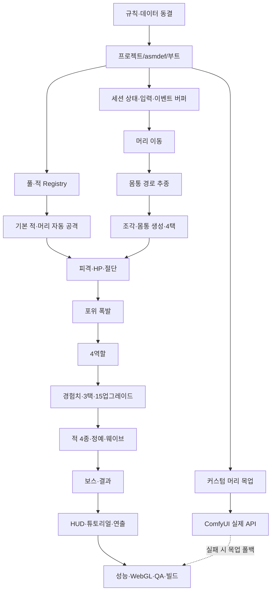

# OUROBOROS: SWARM — Unity 구현순서 및 제작 운영서

> 목표: 3인 4주 안에 `이동 → 자동 공격 → 몸통 축적/역할 선택 → 절단/포위 폭발 → 재성장 → 10분 보스 → 결과/재시작`을 끊김 없이 완성한다.
>
> 구현 기준 문서: `OUROBOROS_SWARM_Unity_설계서.md`
>
> 팀 전제: 프로그래머 1명, 기획·콘텐츠 1명, 아트·UI 1명
>
> 원칙: **코어 세로 슬라이스를 먼저 완성하고 콘텐츠 양과 외부 API는 뒤에 붙인다.**

---

## 0. 구현 우선순위

### 0.1 우선순위 등급

| 등급 | 의미 | 예시 |
| --- | --- | --- |
| P0 | 없으면 코어 게임이 성립하지 않거나 빌드가 막힘 | 이동, 몸통, 절단, 폭발, 역할, 적, 웨이브, 보스, 결과 |
| P1 | P0 완성 후 품질·편의·시연 안정성을 높임 | 게임패드, 세부 옵션, 추가 가독성, 고급 프로파일 도구 |
| P2 | MVP 이후 별도 기획 | 영구 해금, 추가 맵, 일일 도전, 멀티플레이 |
| Risk Track | 코어와 분리해 병행하되 실패해도 P0를 막지 않음 | ComfyUI 실제 API 연동 |

### 0.2 절대적인 선후관계



### 0.3 기능을 시작하지 말아야 하는 조건

- 앞 단계의 데이터 계약과 완료 기준이 통과하지 않았다.
- 같은 규칙을 두 클래스가 동시에 소유하려 한다.
- SO 초기값과 런타임 복사 구조가 정해지지 않았다.
- 풀 반환 시 초기화 항목이 정의되지 않았다.
- 무효 요청의 무부작용 테스트가 없다.
- UI가 규칙을 직접 변경하도록 설계되어 있다.

### 0.4 매일 유지할 빌드 상태

- 컴파일 오류 0
- 예상하지 않은 Console Error/Exception 0
- 시작→전투→사망→재시작 경로가 최소 1회 동작
- `Time.timeScale`, 입력 Map, 정적 이벤트, 풀 활성 수가 재시작 후 초기화
- 그날 구현한 기능의 최소 자동 테스트 또는 수동 체크 기록

### 0.5 구현 현황 기록 규칙

실제 구현 진척의 단일 기준은 이 문서다. 현재 체크박스는 구현 증거와 대조하기 전까지 완료를 의미하지 않는다.

- 구현 변경이 생긴 작업은 종료 전에 영향받은 Step의 `### 구현 현황`과 관련 체크박스를 함께 갱신한다.
- 해당 Step에 `### 구현 현황`이 없으면 `### 목표` 설명 바로 뒤에 다음 형식으로 만든다.

```markdown
### 구현 현황

- 상태: 미착수 | 진행 중 | 차단 | 완료
- 최근 갱신: YYYY-MM-DD
- 완료: 검증까지 끝난 범위와 관련 파일
- 남음: 미구현 항목 또는 다음 작업
- 검증: 테스트 이름/플랫폼/결과, 또는 미실행 사유
```

- 일부 구현은 `진행 중`으로 기록하고 완료된 범위와 남은 범위를 모두 적는다.
- 체크박스의 `[x]`는 구현 증거와 검증 결과가 있을 때만 사용한다. Step의 모든 완료 기준을 충족해야 상태를 `완료`로 바꾼다.
- 회귀나 기준 변경으로 완료 조건을 더 이상 만족하지 않으면 체크박스를 다시 열고 사유를 기록한다.
- 상태 날짜는 KST `YYYY-MM-DD`, 파일 경로는 저장소 상대 경로를 사용한다.
- 규칙, 수치, 데이터 계약, 클래스 책임, 이벤트 순서 또는 수용 기준이 바뀌면 이 문서뿐 아니라 `OUROBOROS_SWARM_Unity_설계서.md`의 관련 절도 같은 작업에서 갱신한다.
- 문서 경로, Unity 기준 버전, 폴더/asmdef 경계, 공통 빌드·테스트 절차 같은 저장소 수준의 전제가 바뀌면 루트 `AGENTS.md`도 갱신한다.

---

## 1. 착수 전 규칙 동결 — Step 00

### 목표

코드를 작성하기 전에 충돌값과 데이터 소유권을 고정한다.

### 구현 현황

- 상태: 완료
- 최근 갱신: 2026-07-18
- 완료: 확정 규칙·가설·데이터 소유권·안정 ID·업그레이드 카탈로그·0~10분 웨이브·범위 등급을 `docs/RuleDecisionLog.md`, `docs/BalanceHypotheses.md`, `docs/AcceptanceCriteria.md`에 등록하고 두 기준 문서와 대조했다. Step 10 G0 브라우저 관찰에서 초기 100개 추적체와 15% 조각 드롭으로 코어 루프 진입이 막히는 것을 확인해 `H-031`에 12개 유지 스폰·1.5초 보충·추적체 조각 25% 가설을 추가했다.
- 남음: 없음. Step 01 프로젝트 기반 작업을 시작할 수 있다.
- 검증: 문서 필수 항목, ID 중복, 금지된 과거 규칙, Markdown 구조를 정적 검사했다. 코드·에셋 변경이 없어 Unity 컴파일 및 테스트는 실행하지 않았다.

### 담당

- 기획·콘텐츠: 규칙표와 초기값
- 프로그래머: 데이터 타입과 기술 가드 검토
- 아트·UI: 역할·위험 신호 식별 규칙 검토

### 작업

- [x] 몸통 디자인 최대치 없음 확정, 기술 가드 64 가설 등록
- [x] 폭발 30%, 최소 4칸, `ceil` 가설 등록
- [x] 머리 피격과 몸통 절단 분리
- [x] 절단 범위 `피격 지점부터 꼬리` 가설 등록
- [x] 선택 우선순위 Body → LevelUp 확정
- [x] 시작 역할 4택 2회 가설 등록
- [x] 역할 4종 수치와 상실 규칙 등록
- [x] 15개 업그레이드 ID와 최대 단계 등록
- [x] 적 4종·정예·보스 ID 등록
- [x] 0~10분 웨이브 표 작성
- [x] P0/P1/P2와 ComfyUI Risk Track 분리

### 산출물

```text
docs/
- RuleDecisionLog.md
- BalanceHypotheses.md
- AcceptanceCriteria.md
```

### 완료 기준

- 같은 항목의 최신값이 문서 두 곳에서 다르지 않다.
- 모든 미확정값에 `[가설]` 표시와 관찰 지표가 있다.
- `최대 몸통 +3`, 폭발 50%, 몸통 최대 20이 P0 규칙에 남아 있지 않다.

---

## 2. 프로젝트 기반 — Step 01

### 목표

씬, 폴더, asmdef, 패키지, 플랫폼 설정을 만들고 빈 빌드가 실행되게 한다.

### 구현 현황

- 상태: 완료
- 최근 갱신: 2026-07-18
- 완료: Unity Editor 기준 버전을 `6000.5.1f1`로 승인·고정했다. `Assets/Ouroboros/` 기반 폴더·asmdef·Input Actions·3개 씬·Windows/WebGL Build Profile·부트 검증·개발 빌드 표시·데이터/플레이스홀더 기준을 구현하고, 두 플랫폼의 Development Build 및 WebGL 메인 메뉴 입력 포커스와 Game 씬 전환까지 확인했다.
- 남음: 없음. Step 02 Core 규칙 타입과 데이터 검증을 시작할 수 있다.
- 검증: `ProjectSettings/ProjectVersion.txt`와 `OSBuildInfo.ExpectedUnityVersion`이 `6000.5.1f1`로 일치한다. Unity 컴파일 오류 0, 세 씬 Missing Script 0. `Ouroboros.Tests.EditMode` 4/4 및 `Ouroboros.Tests.PlayMode` 2/2 통과(정상 Boot→MainMenu→Game, 잘못된 기반 설정에서 Game 진입 차단 및 구체적 오류 1회). Windows Development Build `Builds/Step01/Windows/OuroborosSwarm.exe`와 WebGL Development Build `Builds/Step01/WebGL/index.html` 성공(errors 0, warnings 0). WebGL을 960×540 브라우저 캔버스로 실행해 Enter 입력으로 MainMenu→Game 전환, ASCII HUD 표시, 브라우저 error/warning 0건을 확인했다.

### 선행 조건

- Step 00 완료

### 프로그래머 작업

- [x] Unity `6000.5.1f1` 프로젝트 생성 및 팀 버전 고정
- [x] 2D 프로젝트 설정, Color Space와 해상도 정책 고정
- [x] New Input System 활성화
- [x] TextMeshPro, Unity Test Framework 확인
- [x] 폴더·asmdef 생성
- [x] `00_Boot`, `10_MainMenu`, `20_Game` 씬 생성
- [x] Windows/WebGL Build Profile 생성
- [x] `.gitignore`, 텍스트 직렬화, Visible Meta Files 설정
- [x] `OSBootstrap`, `OSProjectSettingsValidator` 뼈대 작성
- [x] 개발 빌드 로그·버전 문자열 표시

### 기획·콘텐츠 작업

- [x] SO 필드 목록 검수
- [x] 데이터 ID 네이밍 표 작성
- [x] 웨이브 CSV 또는 표를 SO 입력 형식으로 변환

### 아트·UI 작업

- [x] 임시 머리, 몸통 4역할, 일반 적 1종, 투사체, 픽업 스프라이트 제공
- [x] 1920×1080 기준 Canvas 와이어프레임
- [x] 역할별 색+문양+실루엣 규칙 고정

### 생성 파일/클래스

```text
Scripts/Core/OSResultCode.cs
Scripts/Runtime/OSBootstrap.cs
Scripts/Runtime/OSProjectSettingsValidator.cs
Scripts/Runtime/OSBuildInfo.cs
Scripts/Runtime/OSBuildInfoPresenter.cs
Scripts/Runtime/OSMainMenuController.cs
Scripts/Editor/OSProjectSetup.cs
Input/OSInputActions.inputactions
```

### 테스트

- [x] Boot→MainMenu→Game 씬 전환
- [x] Windows 개발 빌드 실행
- [x] WebGL 빈 빌드 실행 및 브라우저 입력 포커스 확인
- [x] asmdef 순환 참조 없음

### 완료 기준

- 빈 프로젝트가 두 플랫폼에서 실행된다.
- Scene에 Missing Script가 없다.
- Boot 검증 실패 시 Game 진입을 막고 구체적인 1회 로그를 남긴다.

---

## 3. Core 규칙 타입과 데이터 검증 — Step 02

### 목표

Scene 없이 테스트 가능한 값 타입, 결과 코드, SO, 런타임 복사 구조를 만든다.

### 구현 현황

- 상태: 완료
- 최근 갱신: 2026-07-18
- 완료: `Assets/Ouroboros/Scripts/Core/`에 필수 enum·readonly struct·`OSRuleResult<T>`·6종 SO·개별/교차 데이터 검증·`OSSessionRuntimeState` 독립 복사를 구현했다. 기본 데이터 에셋과 검증용 적 프리팹을 만들고 `00_Boot`의 `OSBootstrap`이 검증 실패를 `ConfigurationError`로 차단하도록 연결했다. Step 10 G0 가설에 맞춰 `enemy_chaser`의 몸통 조각 드롭 확률을 0.25로 조정하고 Step 02 재생성 코드에도 같은 값을 반영했다.
- 남음: 없음. Step 03 세션 상태·입력·일시정지 구현을 시작할 수 있다.
- 검증: Unity 컴파일 오류 0. `Ouroboros.Tests.EditMode` 13/13 통과(신규 데이터 검증 9건과 Step 01 회귀 4건), `Ouroboros.Tests.PlayMode` 2/2 통과(정상 Boot→MainMenu→Game 및 잘못된 설정 차단). null 프리팹, 중복 ID, 0 요구량, 음수 값, NaN/Infinity, 적격 업그레이드 3개 미만, SO 직렬화 불변, 런타임 상태 독립성을 자동 검증했다. Windows Development Build `Builds/Step02/WindowsPlayer/OuroborosSwarm.exe` 성공(errors 0, warnings 0), WebGL Development Build `Builds/Step02/WebGL/index.html` 성공(errors 0, IL2CPP의 TextMeshPro 대형 메서드 분리 정보성 메시지 3건) 후 Console Error 0을 재확인했다.

### 선행 조건

- Step 01 완료

### 구현 순서

1. enum·readonly struct 정의
2. `OSRuleResult<T>` 구현
3. SO 클래스 구현
4. `OnValidate` 개별 검증
5. 부트 시 교차 참조 검증
6. `OSSessionRuntimeState.InitializeFrom` 구현
7. SO 원본 불변 테스트

### 필수 타입

```text
OSSessionState
OSBodyRoleType
OSSelectionKind
OSPickupType
OSTargetKind
OSCombatEventType
OSUpgradeOperation
OSResultCode
OSRuleResult<T>
OSDamageEvent
OSPickupEvent
OSSelectionRequest
OSExplosionSnapshot
OSSessionSummary
```

### 필수 SO

```text
OSPlayerBalanceData
OSBodyBalanceData
OSEncounterBalanceData
OSWaveScheduleData
OSUpgradeCatalog
OSFeedbackCatalog
```

### 구현 규칙

- 모든 ID는 빈 문자열과 중복을 거부한다.
- 시간·거리·피해·배율은 `float.IsFinite`를 확인한다.
- 요구량과 풀 상한은 1 이상이어야 한다.
- 기술 가드 64는 `OSBodyBalanceData`에 있지만 UI 데이터가 아니다.
- SO 목록을 런타임에서 참조 공유하지 않고 필요한 값은 복사한다.

### EditMode 테스트

- [x] null 프리팹
- [x] 중복 적 ID·업그레이드 ID
- [x] 조각 요구량 0
- [x] 음수 시간·거리·피해
- [x] NaN/Infinity
- [x] 업그레이드 적격 후보 3개 미만
- [x] 세션 초기화 전후 SO 직렬화 해시 동일

### 완료 기준

- 잘못된 데이터로 세션이 시작되지 않는다.
- 재시작마다 새 런타임 상태가 만들어진다.
- 설정 오류와 정상 규칙 거부를 로그/결과 코드로 구분한다.

---

## 4. 세션 상태·입력·일시정지 — Step 03

### 목표

전투 상태 전이와 입력 Map 전환을 먼저 안정화해 이후 시스템이 같은 생명주기를 사용하게 한다.

### 구현 현황

- 상태: 완료
- 최근 갱신: 2026-07-18
- 완료: `Assets/Ouroboros/Scripts/Core/OSSelectionQueue.cs`에 Body 우선·동일 우선순위 FIFO 선택 큐를 구현하고, `Assets/Ouroboros/Scripts/Runtime/OSGameSessionController.cs`와 `OSInputRouter.cs`에 상태 전이·시간 소유·Player/UI Map 상호 배타 전환·입력 콜백 생명주기·재시작 초기화를 구현했다. `Assets/Ouroboros/Scripts/UI/OSSessionStatePresenter.cs`와 `Assets/Ouroboros/Scenes/20_Game.unity`에 최소 세션 경로와 상호 배타 선택 패널을 연결했으며 Step 03 재적용 메뉴를 추가했다.
- 남음: 없음. Step 04 머리 이동과 카메라 구현을 시작할 수 있다.
- 검증: Unity 컴파일 및 최종 Console Error/Exception 0. `Ouroboros.Tests.EditMode` 16/16 통과(선택 큐 Body 우선·FIFO·중복 방지와 기반 회귀), `Ouroboros.Tests.PlayMode` 6/6 통과(입력 구독 회귀, Space 재실행 방지, 선택 중 세션 시간 정지와 unscaled UI 시간, 사망 입력 차단, 재시작 복원, Body 2 + LevelUp 2 순서, 선택 패널 상호 배타). WebGL Development Build `Builds/Step03/WebGL/index.html` 성공(errors 0, warnings 3), Windows Development Build `Builds/Step03/Windows/OuroborosSwarm.exe` 성공(errors 0, warnings 2).

### 선행 조건

- Step 02 완료

### 프로그래머 작업

- [x] `OSGameSessionController` 상태 머신
- [x] `OSInputRouter` Action 구독/해제
- [x] Player/UI Map 상호 배타 전환
- [x] `Time.timeScale` 단일 소유
- [x] 세션 타이머와 unscaled UI 시간 분리
- [x] `OSSelectionQueue` 순수 C# 구현
- [x] Body 요청 우선 규칙
- [x] 상태 확정 후 `StateChanged` 1회 발행
- [x] 재시작 초기화

### 상태 전이 최소 구현

```text
Boot → StartBodySelection(mock) → Combat
Combat → BodyRoleSelection(mock) → Combat
Combat → LevelUpSelection(mock) → Combat
Combat → Dead → Result → Restart
```

이 단계에서는 실제 카드 내용 대신 디버그 버튼으로 요청을 완료해도 된다.

### 테스트

- [x] OnEnable/OnDisable 반복 후 입력 콜백 수 증가 없음
- [x] 선택 진입 프레임의 Space가 복귀 후 폭발로 실행되지 않음
- [x] 선택 중 세션 시간이 증가하지 않음
- [x] UI는 timeScale 0에서도 조작 가능
- [x] 사망 후 Player 입력 무시
- [x] 재시작 후 timeScale=1, Player Map 정상
- [x] Body 2 + LevelUp 2 요청 순서 정확

### 완료 기준

- 상태를 우회해 전투 기능을 호출할 수 없다.
- Player와 UI Map이 동시에 활성화되지 않는다.
- 선택 패널 두 종류가 동시에 열리지 않는다.

---

## 5. 머리 이동과 카메라 — Step 04

### 목표

PC/Web에서 동일한 이동 감각과 장애물 처리를 완성한다.

### 구현 현황

- 상태: 완료
- 최근 갱신: 2026-07-18
- 완료: `Assets/Ouroboros/Scripts/Runtime/OSPlayerController.cs`에 입력 크기 제한·5.5/s 이동·Kinematic `Collider2D.Cast`·접선 슬라이드·마지막 방향·월드 경계·선택/사망 상태 차단·재시작 위치 초기화를 구현했다. `OSCameraFollower.cs`는 고정 줌·무회전·0.1초 지연·카메라 여백 경계를 적용하고, `OSPlayerHeadVisual.cs`와 `Assets/Ouroboros/Art/Placeholders/Obstacle.png`로 머리 펄스/방향 표시와 장애물 3종을 구성했다. `Assets/Ouroboros/Scenes/20_Game.unity`에 `WorldBlocker`/`PlayerHeadSolid` 레이어, 4면 경계, 플레이어 물리와 카메라 참조를 연결하고 Step 04 재적용 메뉴를 추가했다.
- 남음: 없음. Step 05 몸통 경로 추종 구현을 시작할 수 있다.
- 검증: Unity 컴파일 및 최종 Console Error/Exception 0. EditMode 전체 19/19 통과, `Ouroboros.Tests.PlayMode` 12/12 통과(WASD/방향키 일치, 직선/대각선 속도, 0 입력 정지·마지막 방향, Cast 슬라이드, 코너 6,000틱·2분 등가 안정성, 30/60fps 거리, 선택 중 정지, 씬/카메라 여백). Windows Development Build `Builds/Step04/Windows/OuroborosSwarm.exe` 성공(errors 0, warnings 0). WebGL 첫 시도는 Unity 생성 `UnityAnalyticsModule` C 오브젝트의 진단문 없는 Bee ExitCode 3으로 종료됐으나 동일 소스 증분 재빌드가 `Builds/Step04/WebGL/index.html`로 성공(errors 0, warnings 4)했다.

### 선행 조건

- Step 03 완료

### 프로그래머 작업

- [x] `OSPlayerController`
- [x] Move Vector2 크기 제한과 대각선 정규화
- [x] Kinematic Rigidbody2D + Cast 기반 이동
- [x] 장애물 접선 슬라이드
- [x] 마지막 유효 방향
- [x] 머리 월드 경계 제한
- [x] 카메라 추종
- [x] 선택·사망 시 시뮬레이션 중지

### 아트·UI 작업

- [x] 머리 코어 임시 애니메이션/방향 표현
- [x] 장애물 3종 임시 리소스
- [x] 화면 가장자리 여백 검수

### 테스트

- [x] WASD와 방향키 동일 결과
- [x] 직선과 대각선 속도 동일
- [x] 0 입력에서 정지·마지막 방향 유지
- [x] 장애물 모서리에서 떨림·관통 없음
- [x] 30fps/60fps에서 이동 거리 동일
- [x] 선택 중 위치 변화 없음

### 완료 기준

- 2분간 이동해도 경계·장애물에 끼이지 않는다.
- 적이나 몸통이 플레이어를 물리적으로 밀지 않는 기반이 마련된다.

---

## 6. 몸통 경로 추종 — Step 05

### 목표

2~64칸에서 간격이 무너지지 않는 경로 기반 체인을 완성한다.

### 구현 현황

- 상태: 완료
- 최근 갱신: 2026-07-18
- 완료: `Assets/Ouroboros/Scripts/Core/OSPathSampleRingBuffer.cs`에 누적 거리 샘플·고정 배열 원형 버퍼·wrap-around·경계 보간·가상 직선 경로·필요 거리 보존과 64칸 용량 계산을 구현했다. `OSBodyChain.cs`는 머리부터 꼬리 방향 단일 순회로 목표 위치를 계산하고, 안정 ID·체인 인덱스·역할 이벤트와 2/20/40/64 디버그 생성을 제공한다. `PF_BodySegment.prefab`과 Runtime/View 슬롯 64개를 세션 시작 전에 사전 생성하며, `PlayerBodyHurtbox` Trigger는 자기 몸·머리·월드 장애물과 물리 충돌하지 않는다. `20_Game.unity`에는 20칸 디버그 표본과 Step 05 재적용 메뉴를 연결했다.
- 남음: 없음. Step 06 풀·Registry·추적체 기반을 시작할 수 있다.
- 검증: Unity 컴파일 및 Console Error/Exception 0. `Ouroboros.Tests.EditMode` 22/22 통과(누적 거리 경계, wrap-around, 샘플 제거 후 경계 보존, 64칸 용량 329). `Ouroboros.Tests.PlayMode` 17/17 통과(직선·원형·지그재그, 급정지·재출발, 2/20/40/64칸 간격·순서·안정 ID, 가변 스텝 순간이동 방지, 씬 풀/Trigger). WebGL Development Build `Builds/Step05/WebGL/index.html` 성공(job `build-3a69365be4`, 128.67MB, errors 0, warnings 3). `Tools/Serve-WebGL.ps1`로 `http://127.0.0.1:8055/`를 실행해 `index.html`/WASM HTTP 200, WASM MIME `application/wasm`, Chrome 로딩 100%, Canvas 960×540, 브라우저 런타임 오류 0과 메인 메뉴 렌더링을 확인했다. Windows 빌드는 현재 WebGL 전용 반복 검증 규칙에 따라 실행하지 않았다.

### 선행 조건

- Step 04 완료

### 구현 순서

1. `OSPathSampleRingBuffer` 순수 C# 구현
2. 머리 위치 샘플 기록
3. 누적 거리 보간 함수
4. `OSBodySegmentRuntime` 데이터
5. 세그먼트 풀 64개
6. `OSBodyChain.AppendSegment`
7. 세그먼트 순서·ID 이벤트
8. 2/20/40/64 디버그 생성

### 핵심 클래스

```text
OSPathSampleRingBuffer
OSBodyChain
OSBodySegmentRuntime
OSBodySegmentView
```

### 주의

- 세그먼트가 앞 세그먼트 Transform을 `Lerp`로 쫓는 방식은 사용하지 않는다.
- 프레임마다 새 List/Queue를 만들지 않는다.
- 생성 시 경로 길이가 부족한 경우 가상 직선 경로를 사용한다.
- 몸통 Collider는 Trigger이며 서로 충돌하지 않는다.

### EditMode 테스트

- [x] 누적 거리 보간 경계
- [x] 원형 버퍼 wrap-around
- [x] 샘플 제거 후 필요한 거리 보존
- [x] 64칸 필요 경로 용량 계산

### PlayMode 테스트

- [x] 직선·원형·지그재그 경로
- [x] 급정지·재출발
- [x] 2/20/40/64칸 간격 오차
- [x] 프레임 저하 시 순간이동 없음

### 완료 기준

- 64칸에서 체인 순서와 간격이 유지된다.
- 자기 충돌과 머리 충돌이 없다.
- 프로파일러에서 추종 경로의 프레임별 GC Alloc이 0에 가깝다.

---

## 7. 풀·적 Registry·기본 적 — Step 06

### 목표

대량 적 전투의 공통 생명주기와 표적 목록을 만든다.

### 구현 현황

- 상태: 완료
- 최근 갱신: 2026-07-18
- 완료: `OSPoolableBehaviour`와 `OSPoolRegistry`에 키별 고정 배열/스택 사전 생성, 안정 Runtime ID·공격 이벤트 ID, 명시적 Rent/Return, 용량 고갈 거부, 외부·중복 Return 검증을 구현했다. `OSEnemyRegistry`는 최대 200개의 활성 적을 swap-back 배열로 비할당 순회·조회하며, `OSEnemyController`는 Definition 기반 HP·추적 이동·단순 분리·제어·접촉 공격 주기·단일 사망 확정·32유닛 원거리 회수·풀 상태 초기화를 소유한다. `PF_Enemy_Chaser.prefab`에는 Kinematic Rigidbody2D, 분리된 `EnemyHurtbox`/`EnemyHitbox`, 접촉 릴레이와 앵커를 구성했다. `20_Game.unity`는 `enemy_chaser` 200개를 세션 전에 사전 생성하고 G0 동안 12개를 활성 유지하며, 사망 후 1.5초 간격으로 카메라 바깥 고리에 보충한다. `PlayerHeadHurtbox`와 적 전용 레이어 충돌 계약을 연결했으며 재적용 메뉴는 `Ouroboros/Setup/Apply Step 06 Enemy Foundation`이다.
- 남음: 없음. Step 07 머리 자동 공격·투사체 구현을 시작할 수 있다.
- 검증: Unity 6000.5.1f1 컴파일 및 최종 Console Error/Exception 0. Step 10 전체 회귀에서 EditMode 36/36, PlayMode 60/60을 통과했으며, 씬의 200개 사전 생성·12개 활성·사망 후 1.5초 보충과 기존 풀/Registry/물리 계약을 함께 검증했다. 180개 활성 적 120틱의 과거 성능 게이트 284ms·managed allocation 0B도 유지한다. 최종 Step 10 WebGL Canvas에서 12개 G0 배치, 자동 공격, HP/사망 경로와 브라우저 error 0건을 확인했다. Windows 빌드는 WebGL 전용 반복 검증 규칙에 따라 실행하지 않았다.

### 선행 조건

- Step 02 완료
- Step 04 완료

### 프로그래머 작업

- [x] `OSPoolRegistry` 키별 사전 생성
- [x] Rent/Return 계약과 중복 반환 검증
- [x] `OSEnemyRegistry` 활성 배열/리스트
- [x] 안정 Runtime ID 발급
- [x] `OSEnemyController` 공통 HP·이동·사망
- [x] 추적체 1종
- [x] 접촉 공격 주기와 공격 이벤트 ID
- [x] 적끼리 물리 충돌 Off
- [x] 월드에서 너무 멀어진 적 회수 규칙

### 데이터

- 추적체 Definition 1개
- 기본 드롭은 이 단계에서 비활성 가능
- 적 풀 200개까지 사전 생성 가능한 구조

### 테스트

- [x] 200회 Rent/Return 후 상태 잔존 없음
- [x] 중복 Return 거부
- [x] Registry 등록·해제 수 일치
- [x] 적 사망 이벤트 1회
- [x] 적 180 활성에서 GC Alloc과 CPU 측정
- [x] 선택 상태에서 이동·공격 타이머 정지

### 완료 기준

- 적 100마리를 생성해도 물리 밀어내기와 폭발적 CPU 증가가 없다.
- 풀 반환 후 HP·제어·공격 주기가 초기화된다.

---
## 8. 머리 자동 공격·투사체 — Step 07

### 목표

최근접 자동 공격과 길이 전 기본 전투를 완성한다.

### 구현 현황

- 상태: 완료
- 최근 갱신: 2026-07-18
- 완료: `OSEnemyRegistry.FindNearestTarget`에 사거리 안 생존 적 비할당 순회, 거리 동률 기존 표적 유지, 기존 표적이 없을 때 작은 Runtime ID 우선 규칙을 구현했다. `OSHeadWeapon`은 피해 10·주기 0.5초·사거리 6·관통 0을 `OSPlayerBalanceData`에서 읽고, 유효 표적과 `head_projectile` 풀 대여가 모두 성공한 경우에만 주기를 소비한다. `OSProjectile`은 Kinematic 이동·사거리 수명·단일/관통 페이로드·안정 공격 이벤트 ID·고유 적 중복 명중 방지·피해 적용과 풀 반환을 소유하며 발사/피격 피드백 이벤트를 연결했다. `PF_HeadProjectile.prefab`과 `PlayerProjectile` 레이어를 추가하고 120개를 세션 전에 사전 생성했으며, 투사체는 `EnemyHurtbox`에만 판정되고 월드 장애물을 통과한다. `20_Game.unity`의 머리에 자동 무기와 발사점을 연결했고 재적용 메뉴는 `Ouroboros/Setup/Apply Step 07 Head Weapon`이다.
- 남음: 없음. Step 08 조각·몸통 생성 요청·역할 4택 구현을 시작할 수 있다.
- 검증: Unity 컴파일 및 최종 Console Error/Exception 0. `Ouroboros.Tests.EditMode` 22/22 통과(job `59bbd8a2ee9f4e53b6c835b7d8725d4b`), `Ouroboros.Tests.PlayMode` 34/34 통과(job `ec475d12cd2944329d1335998f3da1f3`, 180개 후보 탐색 GC gate 포함). 가장 가까운 적, 동률 표적 유지/작은 Runtime ID, 사거리 밖 미발사, 무대상 3초 후 즉시 발사, 풀 포화 시 주기·피해 불변, 동일 투사체 중복 Collider 1회 피해, 투사체 2발의 적 사망 1회, 실제 씬 자동 처치를 검증했다. WebGL Development Build `Builds/Step07/WebGL/index.html` 성공(job `build-ca5d6f27ca`, 128.75MB, 641.95초, errors 0, warnings 3). `Tools/Serve-WebGL.ps1`로 `http://127.0.0.1:8077/`을 실행해 index/loader/WASM HTTP 200, WASM MIME `application/wasm`, Canvas 960×540, MainMenu→Game→두 선택→Combat 전환, 노란 투사체와 100개 적 무리의 처치 감소를 확인했다. 브라우저 error는 0건이며 WebGL에서 지원되지 않는 URP FSR 후처리 warning 1건만 남았다. Windows 빌드는 WebGL 전용 반복 검증 규칙에 따라 실행하지 않았다.

### 선행 조건

- Step 06 완료

### 프로그래머 작업

- [x] `OSProjectile` 이동·수명·단일/관통 페이로드
- [x] 투사체 풀
- [x] `OSHeadWeapon` 발사 주기
- [x] Registry 비할당 최근접 탐색
- [x] 거리 동률 시 기존 표적 유지/Runtime ID 규칙
- [x] 무대상일 때 주기 미소비
- [x] 피해 적용과 적 사망
- [x] 발사·피격 피드백 이벤트

### 먼저 구현할 범위

- 기본 1발
- 피해 10, 초당 2발, 사거리 6
- 관통 0
- 몸통 길이 배율과 보조탄은 Step 08 이후 연결

### 테스트

- [x] 가장 가까운 적 선정
- [x] 같은 거리 기존 표적 유지
- [x] 기존 표적 없음 시 작은 Runtime ID
- [x] 사거리 밖 미발사
- [x] 무대상 3초 후 적 진입 시 즉시 발사
- [x] 풀 포화 시 주기·피해 무변경
- [x] 같은 투사체가 같은 적 다중 Collider에 1회만 피해

### 완료 기준

- 이동만 조작해 추적체를 처치할 수 있다.
- 적 180 후보를 스캔해도 프레임별 GC Alloc이 발생하지 않는다.

---

## 9. 조각·몸통 생성 요청·역할 4택 — Step 08

### 목표

적 처치에서 몸통 성장 선택까지의 축적 루프를 연결한다.

### 구현 현황

- 상태: 완료
- 최근 갱신: 2026-07-18
- 완료: `OSPickup`·`OSPickupSpawner`·머리 전용 `OSPickupCollector`를 추가하고 `enemy_chaser` 사망 시 정의된 확률·수량으로 몸통 조각을 드롭하도록 연결했다. 같은 종류 픽업은 1.5 반경에서 amount를 병합하고, 256개 풀이 포화되면 가장 가까운 같은 종류 픽업에 총량을 보존하며, 선택 중에는 자석 이동과 수집을 멈춘다. 순수 C# `OSBodyGrowthProgress`와 `OSBodyGrowthController`가 조각 12 경계, 한 번에 여러 요청, 활성+대기 64 기술 가드, 공간 발생 후 보류 요청 1건 재개를 소유한다. `OSBodyRoleSelectionPanel`은 Shield/Attack/Laser/Control 고정 4장을 같은 순서로 표시하고 요청마다 정확히 한 번만 확정하며, 선택한 역할을 `OSBodyChain.AppendSegment`로 꼬리에 추가한다. 시작 역할 요청 2건도 같은 경로를 사용한다. `OSHeadWeapon`에는 `base × runtime multiplier × (1 + L × 0.04)` 피해와 `1 + floor(L / 5)`발, 4도 간격 보조탄을 연결했다. `20_Game.unity`, `PF_Pickup_BodyFragment.prefab`, Pickup/PickupCollector 레이어와 풀 항목을 구성했고 재적용 메뉴는 `Ouroboros/Setup/Apply Step 08 Body Growth`이다.
- 남음: 없음. Step 09 피격·HP·몸통 절단 구현을 시작할 수 있다.
- 검증: Unity 6000.5.1f1 컴파일 및 최종 Console Error/Exception/Warning 0. EditMode 전체 27/27, `Ouroboros.Tests.PlayMode` 전체 42/42 통과. 11/12·23/24 경계, Body 요청 직렬화, 동일 프레임 중복 확정 방지, 고정 카드 4개, 64 보류·꼬리 제거 후 재개, 근접/풀 포화 병합 총량, 선택 중 수집 정지, L=4/5/10 피해·보조탄, 시작 2회 선택, 조각 선택 19회로 21칸 성장까지 자동 검증했다. 최종 증분 WebGL Development Build `Builds/Step08/WebGL/index.html` 성공(128.80 MiB, 12.15초, errors 0, warnings 0; 최초 전체 빌드 352.08초). `Tools/Serve-WebGL.ps1`로 `http://127.0.0.1:8089/`을 실행해 index/WASM HTTP 200, WASM MIME `application/wasm`, Canvas 960×540, MainMenu→고정 4역할 카드→Shield/Attack 두 선택→Combat, 실시간 `BODY 2 / S 1 / A 1` HUD, 자동 공격과 실제 처치 드롭 수집 후 `FRAGMENT 2/12` 증가를 확인했다. 브라우저 error/exception은 0건이며 WebGL에서 지원되지 않는 URP FSR 후처리 warning은 로드당 1건만 남았다. Windows 빌드는 WebGL 전용 반복 검증 규칙에 따라 실행하지 않았다.

### 선행 조건

- Step 05 완료
- Step 07 완료
- Step 03 선택 큐 완료

### 구현 순서

1. `OSPickup`, `OSPickupSpawner`
2. PickupCollector Trigger 후보 등록
3. 몸통 조각 진행도
4. 12 경계와 다중 요청
5. `OSBodyRoleSelectionPanel`
6. 4개 역할 카드 고정 표시
7. 선택 확정 후 `AppendSegment(role)`
8. 시작 요청 2건 연결
9. 64 기술 가드와 보류 재개
10. 현재 몸통 수에 따른 머리 피해·보조탄 연결

### 이 단계의 역할 구현 범위

- 역할 로직은 아직 없고 역할별 스프라이트·문양만 표시한다.
- 모든 역할 세그먼트는 공통 길이 화력에 동일하게 기여한다.

### 픽업 병합

- [x] 같은 종류 근접 픽업 amount 병합
- [x] 풀 포화 시 가장 가까운 같은 종류에 값 보존
- [x] 선택 중 이동·수집 정지

### 테스트

- [x] 조각 11→요청 없음, 12→1건
- [x] 23→1건+11, 24→2건
- [x] Body 요청 여러 건 직렬 처리
- [x] 클릭·Submit 중복으로 세그먼트 2개 생성되지 않음
- [x] 역할 카드 4개가 정확히 한 번씩 표시
- [x] 활성+대기 64에서 요청 보류
- [x] 세그먼트 제거를 디버그 호출한 뒤 보류 요청 재개
- [x] L=4/5/10의 머리 피해·보조탄

### 완료 기준

- 시작 2회 선택 후 전투가 시작된다.
- 조각 12개마다 선택한 역할 외형의 세그먼트가 꼬리에 1칸만 추가된다.
- 20칸을 넘어 성장한다.

---

## 10. 피격·HP·몸통 절단 — Step 09

### 목표

머리 HP 손실과 몸통 길이 손실을 명확히 분리한다.

### 구현 현황

- 상태: 완료
- 최근 갱신: 2026-07-18
- 완료: 모든 적 접촉 대상에 같은 `AttackEventId`를 전달하고, 순수 C# `OSCombatEventBuffer`가 물리 틱별 피해 후보를 수집·중복 제거·결정 정렬하도록 구현했다. `OSPlayerCombatResolver`는 머리 후보를 먼저 확정한 뒤 생존한 경우에만 가장 머리에 가까운 몸통 후보 1건을 처리한다. 같은 공격의 머리+몸통 접촉은 머리 1건으로 축약하고 다른 공격끼리는 머리 피해 후 몸통 절단 순서를 지킨다. `OSPlayerHealth`에 데이터 기반 최대 HP, 0.6초 피격 무적, 별도 폭발 무적, 회복 상한, 즉시 사망 요청과 새 세션 초기화를 연결했다. `OSBodyChain.TryCutFrom`은 피격 지점부터 꼬리까지를 꼬리→머리 역순으로 비활성화하면서 외부에는 원래 머리→꼬리 안정 ID 목록을 전달하고, 0.35초 전체 절단 방지와 제거 전·후·절단 이벤트를 제공한다. `OSPlayerHealthPresenter`가 HP·무적·머리 피해·절단 원인과 범위를 HUD에 표시한다. `20_Game.unity`, `PF_BodySegment.prefab`과 적 접촉 파이프라인을 연결했으며 재적용 메뉴는 `Ouroboros/Setup/Apply Step 09 Damage And Cutting`이다.
- 남음: 없음. Step 10 포위 폭발 세로 슬라이스를 시작할 수 있다. 역할별 실드·공격·레이저·제어 효과는 설계된 Step 11 범위다.
- 검증: Unity 6000.5.1f1 컴파일 및 최종 Console Error/Exception 0. EditMode 전체 31/31, `Ouroboros.Tests.PlayMode` 전체 51/51 통과. 머리 HP 감소와 무적 비갱신, 첫/중간/꼬리 절단, 몸통 피격 시 HP 불변, 같은 틱 최소 인덱스, 절단 방지, 같은 공격 머리 우선, 다른 공격 머리 후 절단, 사망 틱 절단 중단, 적의 다중 접촉 동일 공격 ID, 씬 재시작 HP 복원을 자동 검증했다. WebGL Development Build `Builds/Step09/WebGL/index.html` 성공(128.86 MiB, errors 0, warnings 3). `Tools/Serve-WebGL.ps1`로 `http://127.0.0.1:8099/`을 실행해 index/WASM HTTP 200과 WASM MIME `application/wasm`을 확인했다. 브라우저 Canvas에서 MainMenu→시작 몸통 2회→Combat, `HP 100/100`에서 접촉 후 `HP 44/100`·`INVULN 0.3s`, 몸통 `2→0`, HP 0 사망, Result, 재시작 후 `HP 100/100` 초기화까지 확인했으며 런타임 오류 화면은 발생하지 않았다. Windows 빌드는 WebGL 전용 반복 검증 규칙에 따라 실행하지 않았다.

### 선행 조건

- Step 06 공격 이벤트
- Step 08 몸통 Collider/ID

### 구현 순서

1. `OSDamageEvent` 공격 ID 정책
2. `OSCombatEventBuffer` BeginTick/Enqueue/Drain
3. 같은 공격 머리+몸통 중복 축약
4. `OSPlayerHealth` 피해·무적·회복
5. `OSBodyChain.TryCutFrom`
6. 같은 틱 여러 절단 후보 중 머리 쪽 1개 선정
7. 0.35초 전체 몸통 절단 방지
8. 역할 등록 해제 훅(아직 빈 구현 가능)
9. 사망 즉시 후속 단계 중단
10. 절단 피드백 이벤트

### 절단 구현 체크

- 제거 순서는 꼬리부터 역순으로 풀 반환해 인덱스 변형을 피한다.
- 외부에는 제거된 안정 ID 목록을 원래 머리→꼬리 순으로 제공한다.
- 제거 전 폭발 예약 관리자에 통지할 수 있는 API를 마련한다.
- 절단으로 조각·경험치가 생성되지 않는다.

### 테스트

- [x] 머리 피격 HP 감소·0.6초 무적
- [x] 무적 중 HP·무적 시간 무변경
- 실드 후보 미소비는 실드 후보가 실제로 생기는 Step 11-D의 `무적·절단 방지 피격에는 미소비` 항목에서 통합 검증한다.
- [x] 첫/중간/꼬리 세그먼트 절단
- [x] 몸통 피격 HP 불변
- [x] 같은 틱 몸통 여러 인덱스 중 가장 작은 인덱스 적용
- [x] 절단 방지 중 추가 절단 무시
- [x] 같은 공격 머리+몸통 → 머리만
- [x] 다른 공격 머리+몸통 → 머리 후 생존 시 절단
- [x] 머리 피해로 사망 시 절단 미처리

### 완료 기준

- 절단 원인과 제거 범위가 화면에서 식별된다.
- 사망 틱의 규칙 결과가 물리 콜백 순서와 무관하다.

---

## 11. 포위 폭발 세로 슬라이스 — Step 10

### 목표

게임의 핵심인 `축적 → 방출 → 약화 → 재성장`을 처음부터 끝까지 플레이 가능하게 한다.

### 구현 현황

- 상태: 완료
- 최근 갱신: 2026-07-18
- 완료: `OSExplosionMath`와 `OSExplosionController`에 N≥4, `ceil(N×0.30)`, 꼬리 안정 ID·고정 위치 예약, 0.25초 예고, 예고 중 절단 예약 축소, 합집합 고유 적 `A×35` 1회 피해, 같은 원자 처리의 꼬리 소비, 0.4초 머리 무적과 Body 우선 선택 재개를 구현했다. 컨트롤러 실행 순서를 `OSPlayerCombatResolver` 뒤로 고정해 같은 물리 틱의 머리 피해·절단을 먼저 확정하며, A=0·사망·클리어는 무소비 취소한다. `OSExplosionPresenter`와 20개 사전 생성 `LineRenderer`가 예약 범위·예상 잔여 수·결과를 HUD에 표시하고, `20_Game.unity`와 Space 입력을 연결했다. G0 진입을 위해 디버그 추적체는 200개 풀 중 12개만 활성 유지하고 1.5초 간격으로 보충하며 `enemy_chaser` 조각 드롭 가설을 25%로 조정했다. 재적용 메뉴는 `Ouroboros/Setup/Apply Step 10 Encirclement Explosion`이다.
- 남음: 없음. Step 11의 Shield/Attack/Laser/Control 실제 역할 효과를 시작할 수 있다.
- 검증: Unity 6000.5.1f1 컴파일 및 최종 Console Error/Exception 0. EditMode 36/36, PlayMode 60/60 통과. `OSExplosionMathEditModeTests`, `OSExplosionControllerPlayModeTests`, `OSStep10ScenePlayModeTests`로 N=3 거부, 4/5/10/64 소비 수, 역할 무관 꼬리 예약, 재입력, 합집합 중복 피해 방지, 예고 중 일부/전체 절단, 이중 제거 방지, 선택·사망 우선순위와 `축적→절단→폭발→재성장→사망→재시작` G0 규칙 경로를 자동 검증했다. 최종 WebGL Development Build `Builds/Step10/WebGL/index.html` 성공(128.96 MiB, errors 0, warnings 5). `http://127.0.0.1:8100/`에서 index/WASM HTTP 200, WASM MIME `application/wasm`, MainMenu→시작 역할 2회→12개 추적체 Combat→HP 사망 화면과 브라우저 error 0건을 확인했다. Windows 빌드는 실행하지 않았다.

### 선행 조건

- Step 08 몸통 생성
- Step 09 절단·이벤트 우선순위

### 구현 순서

1. `OSExplosionController.RequestExplosion`
2. N≥4 조건과 `K=ceil(N×0.30)`
3. 꼬리 안정 ID·위치 예약
4. 0.25초 예고 상태 전이
5. 예약 원 View와 HUD 예상 수
6. 절단 시 예약 ID 즉시 제거
7. 완료 틱에서 A 계산
8. Registry 후보 순회와 원 합집합 검사
9. 고유 적 `A×35` 1회 피해
10. 같은 원자 처리에서 예약 세그먼트 소비
11. 0.4초 머리 무적
12. 대기 Body/LevelUp 요청 재개
13. A=0 취소

### 테스트

- [x] N=3 무소비 거부
- [x] 4→2, 5→2, 10→3, 64→20
- [x] 꼬리부터 역할 무관 예약
- [x] 예고 중 이동·자동 공격 유지
- [x] 예고 중 재입력 무시
- [x] 원 중첩 적 1회 피해
- [x] 예고 중 절단 후 A 감소
- [x] 예약 전체 절단 후 A=0 취소
- [x] 같은 세그먼트 절단+폭발 이중 제거 없음
- [x] 폭발 완료와 조각 수집 동시 → 폭발 후 선택
- [x] 폭발 완료와 사망 동시 → 사망 우선

### 코어 세로 슬라이스 게이트 G0

다음 경로를 3분 테스트 씬에서 반복한다.

```text
시작 역할 2개 선택
→ 이동·자동 공격
→ 조각 수집과 몸통 성장
→ 몸통 피격 절단
→ 몸통 4칸 이상에서 폭발
→ 화력 감소
→ 다시 조각을 모아 재성장
→ 사망·재시작
```

### G0 합격 기준

- 진행 막힘 0
- 규칙 오류/Exception 0
- 폭발 전에 소비 세그먼트와 범위를 예측 가능
- 폭발 후 다음 머리 발사부터 화력 감소
- 재시작 시 몸통·HP·큐·예약 모두 초기화

G0를 통과하기 전에는 적 종류, 보스, 실제 ComfyUI API를 늘리지 않는다.

---

## 12. 역할 몸통 4종 — Step 11

### 목표

몸통 선택이 길이뿐 아니라 전투 기능 선택이 되게 한다.

### 선행 조건

- Step 09 피격 파이프라인
- Step 10 절단·폭발 제거 훅

### 권장 구현 순서

#### 11-A 공격 역할

이유: 머리 자동 공격·투사체를 재사용할 수 있어 가장 빠르게 역할 등록 구조를 검증한다.

- [ ] 역할별 활성 세그먼트 런타임 목록
- [ ] 세그먼트 기준 최근접 표적
- [ ] 세그먼트별 독립 1초 주기
- [ ] 피해 6 투사체
- [ ] 제거 후 새 발사 없음, 기존 탄 유지

테스트:

- [ ] 공격 세그먼트 수와 발사 수 일치
- [ ] 같은 적 동시 공격 가능
- [ ] 풀 포화 세그먼트 주기 무변경

#### 11-B 레이저 역할

- [ ] 2.5초 주기
- [ ] 시작점·방향 스냅샷
- [ ] 0.2초 예고
- [ ] 길이 7, 폭 0.35 비할당 판정
- [ ] 고유 적 1회 피해 12
- [ ] 예고 중 세그먼트 제거 취소

테스트:

- [ ] 예고 View와 판정선 좌표 일치
- [ ] 복수 적 관통
- [ ] 같은 적 다중 Collider 1회
- [ ] 다른 레이저는 각각 피해 가능

#### 11-C 제어 역할

- [ ] 피해 0 제어탄
- [ ] 4초 주기, 사거리 6
- [ ] 일반 1초, 정예/보스 0.5초
- [ ] 남은 시간과 새 시간 중 큰 값
- [ ] 적 데이터에 이동/공격 영향 분리

테스트:

- [ ] HP 무변경
- [ ] 재적용 비합산
- [ ] 선택 중 제어 시간 정지
- [ ] 보스 패턴 캐스팅 취소 없음

#### 11-D 실드 역할

이유: 피격 우선순위와 직접 결합하므로 나머지 역할보다 뒤에 구현한다.

- [ ] 반경 1.5, 세그먼트당 충전 1
- [ ] 피격점 최근접 실드 선정
- [ ] 동률 시 머리 쪽 인덱스
- [ ] 머리/몸통 유효 피격 1건 무효
- [ ] 전투 시간 6초 재충전
- [ ] 무적·절단 방지 피격에는 미소비
- [ ] 제거 시 충전·타이머 폐기

테스트:

- [ ] 머리/몸통 방어
- [ ] 중첩 실드 1개만 소비
- [ ] 재충전 중 선택 정지
- [ ] 제거 후 재충전 이벤트 없음

### 통합 테스트

- [ ] 역할 4개가 색 없이 문양/형태로 구분
- [ ] 중간 절단 시 잘린 역할만 상실
- [ ] 폭발 꼬리 소비로 역할이 순서대로 상실
- [ ] 역할 상실 후 공통 길이 화력도 감소
- [ ] 역할 효과가 선택·사망 중 진행하지 않음

### 완료 기준

- 어떤 역할을 선택했는지 전투에서 실제로 구분된다.
- 역할 제거 후 유령 발사·실드·레이저가 남지 않는다.

---

## 13. 경험치·레벨업 3택·업그레이드 — Step 12

### 목표

로그라이트 런 빌드를 완성한다.

### 선행 조건

- Step 03 선택 큐
- Step 07 적 처치
- Step 08 픽업
- Step 11 역할 수치 조정 API

### 구현 순서

1. 경험치 픽업과 요구량 15, 이후 ×1.18
2. 다중 레벨업 요청
3. `OSRunRandom` 시드
4. `OSUpgradeCatalog.GetEligibleEntries`
5. 중복 없는 후보 3개
6. 레벨 1~3 계열 보정
7. `OSLevelUpPanel`
8. 업그레이드 적용 연산
9. 현재→적용 후 수치 UI
10. 결과 통계 기록

### 업그레이드 적용 순서

- [ ] 머리 피해
- [ ] 머리 발사 속도
- [ ] 관통
- [ ] 조각 요구량
- [ ] 몸통 칸당 배율
- [ ] 역할 과충전
- [ ] 폭발 범위/피해/소비율
- [ ] 최대 HP/이동/회복
- [ ] 자석/경험치
- [ ] 정예 우선

### 테스트

- [ ] 후보 ID 3개 고유
- [ ] 최대 단계 제외
- [ ] 레벨 1~3 각 화면 공격/몸통/생존 1개
- [ ] Body 요청과 동시이면 Body 전부 먼저
- [ ] 선택 중 전투 완전 정지
- [ ] 오래된 요청·중복 클릭 무부작용
- [ ] 같은 시드에서 같은 후보 순서
- [ ] SO 원본 단계 변경 없음
- [ ] 수치 하한/상한: 발사 주기, 조각 요구량, 폭발 소비율

### 완료 기준

- 한 런에서 지속 화력·폭발·안전 재건 방향의 차이가 체감된다.
- 선택 실패나 사망 취소로 업그레이드가 중복 적용되지 않는다.

---

## 14. 일반 적 4종·웨이브·정예 — Step 13

### 목표

10분 동안 시간 기반 군집 압박을 만든다.

### 선행 조건

- Step 07 기본 적 전투
- Step 12 성장

### 구현 순서

1. `OSWaveDirector` 시간 구간·스폰 티켓
2. 카메라 바깥 고리 스폰
3. 플레이어 거리·장애물·경계 검증
4. 활성 적 상한 180
5. 추적체 데이터 확정
6. 돌진체 예고→돌진→회복
7. 사격체 거리 유지→예고→발사
8. 분열체 사망→소형 2개
9. 60초 조합 확장
10. HP ×1.12/분, 생성 압력 ×1.15/분 데이터 적용
11. 정예체와 오라
12. 3분·6분 강제 등장
13. 9분 보스 예고 전 웨이브

### 적별 완료 기준

#### 추적체

- 플레이어를 직선 추적하고 과도한 군집 겹침만 조향으로 완화
- 접촉 공격 주기가 Collider 프레임 수에 의존하지 않음

#### 돌진체

- 예고선과 실제 돌진 경로 일치
- 제어 중 예고/돌진 상태 규칙 명확
- 화면 밖 돌진으로 즉시 피격하지 않음

#### 사격체

- 공격 거리에서 정지 또는 측면 이동
- 발사 전 점등과 방향 예고
- 투사체 풀 포화 시 공격 주기 무변경 또는 명시 정책

#### 분열체

- 사망 1회에 소형 2개
- 소형은 재분열하지 않음
- 적 상한 도달 시 가능한 수만 생성하고 중복 로그 없음

#### 정예체

- 오라 범위와 영향 상태 식별
- 오라 중첩 정책 적용
- 정예 우선 업그레이드 연결

### 웨이브 테스트

- [ ] 0~10분 시간을 가속한 스케줄 검증
- [ ] 3분·6분 정예 정확히 1회
- [ ] 9분 예고 정확히 1회
- [ ] 화면 안 스폰 없음
- [ ] 장애물 내부 스폰 없음
- [ ] 적 180에서 추가 스폰 연기
- [ ] 선택 중 웨이브 시간 정지
- [ ] 재시작 후 시간표 초기화

### 7분 빌드 게이트 G1

- 0~7분까지 진행 막힘 없이 플레이
- 적 4종과 정예 2회 등장
- 역할·업그레이드 선택과 폭발이 동시 요청 규칙을 지킴
- 평균 화면 적 수와 위험 신호 판독성 기록

---
## 15. 보스·클리어·결과 — Step 14

### 목표

10분 런의 종착점과 재시작까지 완성한다.

### 선행 조건

- Step 13 웨이브·정예

### 구현 순서

1. 10:00 보스 Spawn 이벤트
2. `OSBossController` 또는 Boss용 행동 상태
3. 보스 HP 6,000과 90초 제한 가설
4. 부채꼴 탄
5. 군집 소환
6. 흡인 펄스
7. 보호막
8. HP 비율 페이즈
9. 보스 HP/보호막 HUD
10. 보스 사망→Cleared
11. 시간 초과→실패
12. `OSSessionSummary.Build`
13. `OSResultPanel`
14. 재시작·메뉴

### 패턴 구현 원칙

- 패턴별 예고·실제 판정·회복 상태를 명시한다.
- 제어는 이동을 제한하지만 캐스팅을 취소하지 않는다.
- 소환은 적 상한 안에서만 발생한다.
- 한 시점에 겹치는 고위험 예고 수를 제한한다.
- 보호막은 지속 화력의 가치를, 소환은 폭발의 가치를 제공한다.

### 결과 통계

- [ ] 결과 종류
- [ ] 생존 시간
- [ ] 최대/최종 몸통
- [ ] 획득/절단/폭발 소비 몸통
- [ ] 총/폭발/정예 처치
- [ ] 받은 머리 피해
- [ ] 역할별 최대/최종 수
- [ ] 업그레이드 단계
- [ ] 런 시드·데이터 버전(개발 빌드)

### 테스트

- [ ] 9분 예고 후 10분 등장
- [ ] 보스 중 선택 상태에서 패턴·제한 시간 정지
- [ ] 보호막과 본체 HP 분리
- [ ] 보스 소환이 180 상한 초과하지 않음
- [ ] 보스 사망 이벤트 1회
- [ ] 플레이어·보스 동시 사망은 머리 피해 우선 규칙 적용
- [ ] 결과 화면에서 전투 입력 불가
- [ ] 재시작 10회 후 풀·이벤트·시간 누수 없음

### 10분 빌드 게이트 G2

- 시작 역할 선택부터 보스 처치/사망 결과까지 1회 완주
- 재시작 후 동일 경로 재진입
- Console Error/Exception 0
- 동시 사건 테스트 통과

---

## 16. HUD·튜토리얼·전투 판독성 — Step 15

### 목표

규칙은 완성되어 있어도 읽히지 않는 문제를 제거한다.

### 선행 조건

- Step 14 전체 런

### 구현 순서

1. HUD 표시 모델과 이벤트 바인딩
2. HP·몸통·조각·경험치·타이머
3. 역할별 개수·실드 충전
4. 폭발 예상 소비·예약 변경
5. 정예·보스 예고
6. 역할 4택·레벨업 3택 최종 UI
7. 조건 기반 튜토리얼
8. 절단·역할 상실 피드백
9. 위험 신호 우선순위 조정
10. 색각에 의존하지 않는 형태·문양 확인
11. 결과 화면 최종 레이아웃

### 아트·UI 담당 체크

- [ ] 머리 코어가 모든 군집 위에서 식별됨
- [ ] 4역할이 흑백 캡처에서도 구분됨
- [ ] 레이저 예고와 실제 폭이 동일함
- [ ] 돌진·사격·보스 예고가 플레이어 공격보다 위에 보임
- [ ] 폭발 예약 세그먼트와 유지 세그먼트가 구분됨
- [ ] 절단 경계와 꼬리 방향 소멸이 보임
- [ ] 실드 충전/재충전 상태가 보임
- [ ] 제어 적의 남은 상태가 보임
- [ ] 기술 가드 64가 최대치로 표시되지 않음

### 프로그래머 체크

- [ ] UI는 규칙 상태를 직접 수정하지 않음
- [ ] 이벤트를 표시 모델에 모아 프레임 말 1회 갱신
- [ ] 패널 비활성/재활성 시 구독 중복 없음
- [ ] 피드백 풀 부족이 전투 결과에 영향 없음
- [ ] timeScale 0에서도 카드 포커스/애니메이션 정상

### 수동 테스트

- [ ] 적 150에서 머리·위험·픽업 구분
- [ ] 몸통 40/64에서 HUD 겹침 없음
- [ ] 연속 절단·폭발 예약 변경 시 중복 효과음 없음
- [ ] 첫 플레이 60초 내 이동·자동 공격 이해
- [ ] 첫 폭발 전 소비량과 범위를 예측

### 완료 기준

- 테스터가 사망 원인과 절단 원인을 구분해 설명할 수 있다.
- 역할 선택 결과가 전투 화면에서 확인된다.

---

## 17. 사운드·VFX·연출 — Step 16

### 목표

핵심 정보 전달을 강화하고 장식이 규칙을 가리지 않게 한다.

### 선행 조건

- Step 15 UI 우선순위 확정

### 우선 제작 순서

1. 머리 피격·무적
2. 몸통 절단
3. 폭발 예고·발동·공간 비우기
4. 실드 충전·방어·재충전
5. 레이저 예고·발사
6. 제어 적용
7. 돌진·사격·보스 강공격 예고
8. 레벨업·역할 선택 확정
9. 일반 발사·피격
10. 장식 파티클

### 성능 규칙

- 파티클은 풀링한다.
- 투명 오버드로우가 큰 전면 이펙트를 제한한다.
- 같은 종류 효과음 동시 재생 수를 제한한다.
- 저품질 설정은 장식 파티클 수만 줄이고 텔레그래프는 유지한다.
- 데미지 숫자는 기본 Off 또는 초당 표시 수 제한을 둔다.

### 완료 기준

- 소리를 끈 상태와 색을 구분하기 어려운 상태에서도 핵심 위험을 읽을 수 있다.
- 장식 VFX 제거 시 게임 규칙 판독성이 떨어지지 않는다.

---

## 18. 성능 최적화·WebGL — Step 17

### 목표

공통 규칙과 상한으로 Windows 60fps, WebGL 30fps 목표를 검증한다.

### 선행 조건

- Step 16 전체 기능

### 측정 순서

1. Development Build + Autoconnect Profiler
2. 빈 씬 기준
3. 적 180
4. 적 180 + 투사체 120
5. 위 상태 + 몸통 20
6. 몸통 40
7. 몸통 64
8. 폭발 예약 20
9. 레이저 다중 + 픽업 256
10. 보스 + 정예 오라 + 소환
11. 10분 실세션 메모리 추적

### 최적화 우선순위

1. 프레임별 GC Alloc 제거
2. Instantiate/Destroy 제거
3. 몸통 경로 순회 비용
4. 역할별 적 전체 탐색 빈도
5. 폭발/레이저 물리 조회
6. 적 이동·분리 조향
7. 파티클 오버드로우
8. HUD Layout rebuild
9. 사운드 동시 수

### 구현 체크

- [ ] Update/FixedUpdate LINQ 없음
- [ ] `FindObjectOfType`, `GameObject.Find` 없음
- [ ] 물리 NonAlloc API 또는 Registry 순회
- [ ] 역할 타이머가 프레임마다 후보 목록을 만들지 않음
- [ ] 세그먼트 64 풀 사전 생성
- [ ] 적/투사체/픽업/VFX 활성 상한
- [ ] 픽업 값 병합으로 총량 보존
- [ ] 브라우저 포커스 이탈 시 입력 초기화
- [ ] WebGL에서 파일 경로·스레드 의존 없음
- [ ] 메모리 지속 증가 없음

### 성능 실패 처리

| 문제 | 우선 대응 | 금지 대응 |
| --- | --- | --- |
| 적 CPU 과다 | 조향 주기 분산, Registry 최적화 | Web만 적 상한을 낮춰 난이도 변경 |
| 몸통 CPU 과다 | 경로 탐색 캐시, 단일 순회 | 디자인 최대 길이 20으로 되돌림 |
| 투사체 과다 | 관통/레이저 가치 조정, 풀·조회 최적화 | 명중 판정 누락 |
| 픽업 과다 | amount 병합 | 경험치·조각 삭제 |
| VFX 과다 | 장식 수·수명 감소 | 텔레그래프 제거 |
| UI 과다 | 표시 모델 배치 갱신 | 상태 갱신 지연으로 잘못된 수치 표시 |

### 완료 기준

- 목표 fps와 피크 프레임, 메모리 결과를 문서화한다.
- 성능 미달이면 병목과 재검증 상태를 남기고 배포 승인을 보류한다.

---

## 19. 커스텀 머리 목업·ComfyUI — Risk Track

### 원칙

- 코어 전투와 분리된 병렬 트랙이다.
- 기본 머리 스프라이트로 항상 게임 시작 가능해야 한다.
- 실제 API 실패는 목업/기본 캐릭터로 폴백한다.

### 시작 시점

- Step 01에서 머리 SpriteRenderer 교체 슬롯만 준비
- G0 통과 후 목업 UX 구현
- 실제 API는 G1 이후 안정성 평가

### Track R1: 머리 교체 계약

- [ ] 머리 Sprite가 Collider·무기 기준점과 분리
- [ ] 고정 Pivot·Pixels Per Unit·최대 크기 정의
- [ ] 런타임 Sprite 적용 API
- [ ] 기본/목업 Sprite 캐시

### Track R2: 목업 UX

- [ ] 동의 화면
- [ ] 업로드 화면 모형
- [ ] 전처리 미리보기
- [ ] 스타일 3종
- [ ] Queued/Running/Succeeded/Failed/Canceled 상태
- [ ] 사전 생성 결과 3안
- [ ] 선택·적용·기본 캐릭터 폴백

### Track R3: 실제 API

- [ ] `OSComfyUIClient`
- [ ] HTTPS 요청과 작업 ID
- [ ] 폴링·타임아웃·재시도
- [ ] 취소 API
- [ ] 3안 결과 검증
- [ ] 원본 삭제 요청
- [ ] WebGL CORS 확인
- [ ] 비밀키 클라이언트 미포함

### 3주차 판단 게이트

| 상태 | 4주차 기본 경로 |
| --- | --- |
| 실제 API 성공률·지연·삭제 확인 완료 | 실제 API + 목업 폴백 |
| API 간헐 실패 또는 CORS/인프라 불안정 | 목업 기본, 실제 API 숨김/개발 옵션 |
| 업로드·삭제 정책 미확정 | 실제 API 제외, 기본/목업만 |

### 빌드 차단 조건

- 커스텀 기능 실패로 게임 시작 불가
- 기본 캐릭터 폴백 불가
- 취소 후 입력/패널 잠김
- 원본 삭제 실패를 성공으로 숨김
- WebGL 빌드에 비밀키 포함

---

## 20. 자동 테스트·빌드 게이트 — Step 18

### 게이트 순서

| 게이트 | 내용 | 실패 시 |
| --- | --- | --- |
| G0 | 3분 축적·절단·폭발·재성장 세로 슬라이스 | 콘텐츠 확장 중지 |
| G1 | 적 4종·정예 포함 7분 빌드 | 보스 작업 외 결함 우선 수정 |
| G2 | 10분 보스·결과·재시작 | UI 마감·배포 작업 중지 |
| G3 | EditMode 전 항목 | 빌드 차단 |
| G4 | PlayMode 상태·동시 사건 | 빌드 차단 |
| G5 | HTTP로 실행한 WebGL 10분 수동 스모크 | WebGL 배포 차단 |
| G6 | 성능 피크와 메모리 | 배포 후보 승인 보류 |
| G7 | ComfyUI 실제/목업/기본 폴백 | 커스텀 경로 비활성 또는 빌드 차단 |

### CI 또는 수동 배치 순서

```text
1. EditMode Tests
2. PlayMode Tests
3. WebGL Development Build
4. `Tools/Serve-WebGL.ps1`로 HTTP 실행
5. 브라우저 Canvas·Console 및 WebGL 10분 스모크
6. 성능 시나리오
7. WebGL 배포 후보 빌드
```

### 빌드 보고서 필수 항목

- 빌드 ID와 커밋
- Unity/패키지 고정 버전
- 밸런스 데이터 버전
- 플랫폼과 품질 설정
- 테스트 통과/실패
- 예상하지 않은 Console 로그 수
- 평균/하위 프레임, 최대 프레임 시간
- 메모리 시작/피크/종료
- 커스텀 모드: 실제 API/목업/기본
- WebGL 실행 URL, `index.html` 응답, 브라우저 Canvas·Console 결과
- 미해결 P0 결함과 남은 가설

---
## 21. 3인 4주 실행 일정

아래 일정은 1일 단위를 절대적인 계약으로 보지 않고, 게이트 통과를 기준으로 다음 단계에 진입한다. 프로그래머가 막힌 기능을 아트·기획이 기다리지 않도록 데이터·임시 리소스·테스트 준비를 병렬화한다.

## 21.1 1주차 — 코어 세로 슬라이스

### 주 목표

`시작 선택 → 이동 → 자동 공격 → 몸통 성장 → 절단 → 폭발 → 재성장 → 사망/재시작`이 3분 테스트에서 동작한다.

| 일차 | 프로그래머 | 기획·콘텐츠 | 아트·UI | 일일 확인 |
| ---: | --- | --- | --- | --- |
| 1일 | 프로젝트, asmdef, Boot, SO 뼈대 | 규칙 충돌 정리, ID·수치표 | 역할/적/픽업 임시 리소스 | Windows/WebGL 빈 빌드 |
| 2일 | 결과 타입, 런타임 복사, 세션 상태, Input | 수용 기준·테스트 케이스 | HUD/선택 와이어프레임 | 선택 pause와 Map 전환 |
| 3일 | 머리 이동, 카메라, 경로 버퍼 | 이동·몸통 가설 기록 | 머리/몸통 임시 Sprite 적용 | 20/64칸 추종 디버그 |
| 4일 | 풀, 추적체, 머리 자동 공격, 조각 | 추적체·드롭 초기값 | 발사/피격/조각 최소 VFX | 이동하며 적 처치·몸통 선택 |
| 5일 | HP, 절단, 폭발, 재시작 통합 | 첫 내부 테스트와 수치 기록 | 절단·폭발 예고 최소 표현 | G0 3분 세로 슬라이스 |

### 1주차 완료 조건

- G0 통과
- 몸통 20칸 이후 성장 확인
- 폭발 4→2, 5→2, 10→3 확인
- 절단과 폭발 이중 제거 없음
- 재시작 5회 오류 없음
- 다음 주 역할 구현에 필요한 세그먼트 등록/해제 API 확정

### 1주차 범위 삭감 순서

일정이 밀리면 다음을 뒤로 미룬다.

1. 카메라 흔들림
2. 장애물 종류 추가
3. 정교한 UI 애니메이션
4. 커스텀 캐릭터 실제 API

절단·폭발·재성장 규칙은 삭감하지 않는다.

## 21.2 2주차 — 역할·성장·적 4종·7분 빌드

### 주 목표

4역할과 15종 업그레이드가 작동하고, 일반 적 4종과 정예가 포함된 7분 세션을 완료한다.

| 일차 | 프로그래머 | 기획·콘텐츠 | 아트·UI | 일일 확인 |
| ---: | --- | --- | --- | --- |
| 6일 | 공격 역할, 역할 Registry | 역할별 기대 DPS/효용 표 | 공격 역할 Sprite/VFX | 역할 생성·제거·폭발 상실 |
| 7일 | 레이저·제어 역할 | 역할 중첩/제어 테스트 | 레이저 예고·제어 표식 | 관통·비합산·제거 취소 |
| 8일 | 실드, 피격 우선순위 통합 | 실드/절단 체감 테스트 | 실드 링·충전 상태 | 중첩 실드 1충전 |
| 9일 | 경험치, 3택, 업그레이드 연산 | 15종 데이터 입력·초반 보정 | 레벨업 카드 | 같은 시드 후보 재현 |
| 10일 | 돌진/사격/분열, WaveDirector | 0~7분 웨이브 입력 | 적 4종 위험 예고 | G1 7분 빌드 |

### 2주차 완료 조건

- 역할 4종의 발동·상실 규칙 통과
- Body와 LevelUp 선택 동시 대기 순서 통과
- 15종 업그레이드 후보 중복 없음
- 적 4종·3분/6분 정예 등장
- 7분 진행 막힘 0
- 적 150 상황 1차 판독성 확인

### 2주차 플레이테스트 질문

- 역할 4개가 실제 선택 고민을 만드는가?
- 새로 얻은 꼬리 역할이 폭발로 먼저 사라지는 점을 이해하는가?
- 실드가 절단과 머리 피해를 막는 순간이 읽히는가?
- 폭발 후 재성장 시간이 너무 길거나 짧은가?
- 업그레이드가 몸통 역할 선택을 압도하거나 반대로 무의미한가?

## 21.3 3주차 — 보스·10분 완주·1차 성능

### 주 목표

10분 보스, 결과, 재시작을 완성하고 HTTP로 실행한 WebGL에서 전체 경로를 검증한다.

| 일차 | 프로그래머 | 기획·콘텐츠 | 아트·UI | 일일 확인 |
| ---: | --- | --- | --- | --- |
| 11일 | 7~10분 웨이브, 9분 예고 | 후반 밀도·조합 조정 | 후반 가독성 정리 | 9분 도달 가능 |
| 12일 | 보스 기본/부채꼴/소환 | 보스 패턴 수치 | 보스 임시/예고 | 지속 화력과 폭발 역할 분리 |
| 13일 | 흡인/보호막/페이즈/제어 | 보스 90초 테스트 | 보호막/흡인 연출 | 보스 패턴 동시 수 제한 |
| 14일 | 결과·통계·재시작, PlayMode 보강 | 결과 지표 검수 | 결과 화면 | G2 10분 완주 |
| 15일 | WebGL 1차 최적화, 프로파일 | 난이도 1차 조정 | VFX/사운드 1차 | G3~G5 첫 실행, API 판단 |

### 3주차 완료 조건

- 10분 보스 처치 또는 사망 결과까지 완주
- 재시작 10회 진행 막힘 없음
- EditMode·PlayMode 핵심 테스트 통과
- WebGL 개발 빌드를 HTTP로 실행하고 브라우저 Canvas·Console 확인
- 적180/투사체120/몸통20·40·64 성능 표본 기록
- ComfyUI 실제 API를 4주차 기본으로 둘지 목업으로 고정할지 결정

### 3주차 범위 판단

- 보스 패턴이 불안정하면 패턴 수를 줄이고 예고/판정 정확도를 우선한다.
- 실제 API가 불안정하면 즉시 목업 기본 경로로 전환한다.
- 성능이 미달이면 신규 콘텐츠 추가를 중지한다.

## 21.4 4주차 — 가독성·QA·빌드 마감

### 주 목표

P0 결함을 제거하고 WebGL 배포 후보와 실패 없는 브라우저 시연 경로를 만든다.

| 일차 | 프로그래머 | 기획·콘텐츠 | 아트·UI | 일일 확인 |
| ---: | --- | --- | --- | --- |
| 16일 | 프로파일 병목 1차 수정 | 플레이테스트 분석 | 위험 신호 우선순위 | 피크 장면 재측정 |
| 17일 | 동시 사건·재시작 결함 | 수치 2차 조정 | HUD/선택/튜토리얼 마감 | G3/G4 전체 통과 |
| 18일 | WebGL 포커스·메모리·빌드 | 외부 테스트 1 | 사운드/VFX 성능 조정 | 10분 WebGL 스모크 |
| 19일 | P0 버그 수정, API/목업 폴백 | 외부 테스트 2 | 결과/커스텀 UI 마감 | G5~G7 통과 |
| 20일 | 배포 후보, 태그, 백업 | 출시 판단 보고 | 최종 리소스 검수 | 전체 게이트 재실행 |

### 4주차 완료 조건

- 예상하지 않은 Console Error/Exception 0
- Windows 60fps, WebGL 30fps 목표 결과 기록
- 시작→보스/사망→결과→재시작 10회 연속
- 커스텀 성공·실패·취소·기본 폴백 경로
- 치명적 진행 막힘 0
- 남은 가설과 P1/P2 백로그 분리

---

## 22. 역할별 병렬 작업 계약

## 22.1 프로그래머가 기획에 제공할 것

- SO 필드와 허용 범위
- 런타임 디버그 HUD: 시간, 적 수, 몸통 수, 요청 큐, 풀 사용량
- 런 시드 고정 옵션
- 웨이브 시간 배속
- 몸통 2/20/40/64 즉시 생성 명령
- 폭발 N값 경계 테스트 명령
- 적/보스 무적·즉사 개발 명령
- 결과 CSV 또는 로그 출력

## 22.2 기획이 프로그래머에 제공할 것

- 모든 데이터 ID와 초기값
- 가설의 관찰 지표와 변경 이유
- 0~10분 웨이브 조합
- 적 패턴 상태표
- 업그레이드 15종 단계별 수치
- 매 플레이테스트의 재현 시각·런 시드·현상
- P0와 단순 선호 변경의 구분

## 22.3 아트·UI가 프로그래머에 제공할 것

- Pivot, PPU, Sprite 크기 규격
- 역할별 문양·실루엣·색
- 텔레그래프 실제 판정과 일치하는 기준선/원
- VFX 수명과 풀 키
- UI 해상도·Safe Area 기준
- 기본/저품질 파티클 차이
- 머리 커스텀 Sprite 출력 규격

## 22.4 프로그래머가 아트·UI에 제공할 것

- 월드 Anchor와 판정 반경
- 역할·위험 상태 이벤트
- 프리팹 슬롯과 Sorting Layer
- 풀링 생명주기
- 선택 카드 데이터 모델
- 기술 가드와 가변 숫자에 안전한 레이아웃 범위

---

## 23. 시스템별 Definition of Done

기능은 “화면에서 한 번 동작”이 아니라 아래를 모두 만족해야 완료다.

### 공통 DoD

- [ ] 책임 소유 클래스가 하나다.
- [ ] 성공·거부·오류 결과가 구분된다.
- [ ] 무효 요청은 무부작용이다.
- [ ] ScriptableObject 원본을 변경하지 않는다.
- [ ] 상태 확정 후 이벤트를 1회 발행한다.
- [ ] 선택·사망·재시작 생명주기를 처리한다.
- [ ] 풀 반환 시 모든 런타임 상태를 초기화한다.
- [ ] 최소 EditMode 또는 PlayMode 테스트가 있다.
- [ ] 예상하지 않은 Console 로그가 없다.
- [ ] 프로파일러에서 반복 할당 여부를 확인했다.
- [ ] 아트 없이도 디버그 표현으로 규칙을 검증할 수 있다.
- [ ] 아트 적용 후 판정과 표현이 일치한다.

### 데이터 기능 DoD

- [ ] ID 고유성 검증
- [ ] 범위·유한 수 검증
- [ ] 잘못된 설정에서 세션 시작 차단
- [ ] 가설값과 확정값 표시
- [ ] 결과 보고서에 데이터 버전 기록

### UI 기능 DoD

- [ ] 마우스와 키보드로 조작
- [ ] timeScale 0에서 동작
- [ ] 오래된 요청·중복 입력 거부
- [ ] UI가 규칙 객체를 직접 수정하지 않음
- [ ] 1920×1080 및 목표 Web 캔버스에서 잘림 없음
- [ ] 색 외 식별 수단 보유

---

## 24. 결함 우선순위

| 등급 | 정의 | 예시 | 처리 |
| --- | --- | --- | --- |
| Blocker | 빌드·세션 진행 불가, 데이터 손상 | 시작 불가, 결과에서 멈춤, WebGL 크래시 | 즉시 다른 작업 중지 |
| Critical | 핵심 규칙 결과가 틀림 | 폭발 이중 피해, 몸통 중복 생성, 사망 후 선택 적용 | 당일 수정 |
| Major | 플레이 판단을 왜곡 | 예고와 판정 불일치, 역할 상실 표시 누락 | 다음 게이트 전 수정 |
| Minor | 규칙은 맞으나 품질 저하 | 작은 UI 정렬, 장식 VFX | P0 안정 후 처리 |
| Tuning | 수치 가설 조정 | 적 HP, 폭발 간격 | 테스트 데이터와 함께 변경 |

성능 목표 미달은 원인과 측정값이 없는 상태로 “Minor” 처리하지 않는다. 배포 후보 승인 보류 항목이다.

---

## 25. 흔한 구현 실수와 예방

| 실수 | 결과 | 예방 |
| --- | --- | --- |
| 각 세그먼트가 앞 세그먼트를 Lerp 추적 | 긴 체인 간격 붕괴·고무줄 현상 | 누적 거리 경로 샘플 사용 |
| Collider 콜백에서 즉시 HP/절단 처리 | 플랫폼·콜백 순서별 결과 변화 | 이벤트 버퍼 후 중앙 Drain |
| Time.timeScale을 여러 패널이 변경 | 선택 종료 후 전투 정지/재개 오류 | SessionController 단일 소유 |
| SO 값을 업그레이드로 직접 수정 | 재시작 후 강화 잔존 | RuntimeState 복사본만 수정 |
| 몸통 제거 중 정방향 List.RemoveAt | 인덱스 건너뜀 | 꼬리부터 역순 제거 |
| 폭발 원마다 OverlapAll | 할당·중복 피해 | AABB 후보 + 거리 검사 + ID 중복 제거 |
| 역할별 Update에서 매 프레임 적 검색 | 세그먼트 64에서 CPU 폭증 | 쿨다운 도달 시 Registry 순회 |
| 실드가 무적 피격에도 소비 | 플레이어가 규칙을 예측 못함 | 무효 조건 판정 후 실드 |
| 적 접촉을 OnTriggerStay마다 피해 | FPS에 따라 피해량 변화 | 공격 주기와 attackEventId |
| 풀 반환 시 코루틴/ID 미초기화 | 유령 공격·중복 명중 | 명시적 Reset 계약 |
| 64를 HUD 최대치로 표시 | 디자인 무제한 규칙 훼손 | 기술 가드는 개발 로그만 |
| ComfyUI를 게임 시작 필수로 연결 | 외부 장애가 코어 빌드를 막음 | 기본/목업 폴백과 Feature Flag |

---

## 26. 플레이테스트 운영 순서

### 내부 테스트 30분

1. 5분: 오늘 변경 기능 경계값 확인
2. 10분: 정상 런, 개발 치트 금지
3. 5분: 의도적으로 절단·폭발·선택 충돌 재현
4. 5분: 결과 지표와 오류 확인
5. 5분: 관찰 사실과 해석을 분리해 기록

### 기록 템플릿

```markdown
## Test Run
- Build ID:
- Platform:
- Data Version:
- Run Seed:
- Tester:
- Result / Time:
- First Explosion Time:
- Max Body / Final Body:
- Body Lost by Cut / Explosion:
- Build Summary:
- Readability Failure Timestamp:
- Rule Bug Reproduction:
- 유지/소비 고민이 발생한 순간:
- 변경 제안:
- 제안 분류: Bug / Tuning / UX / Scope
```

### 수치 변경 규칙

- 한 테스트 라운드에서 핵심 변수 하나만 크게 바꾼다.
- 변경 전후 빌드 ID와 데이터 버전을 남긴다.
- 체감 의견만으로 코드 규칙을 바꾸지 않는다.
- 수치 조정은 SO에서 하고 조건 분기를 추가하지 않는다.
- 폭발을 강화할 때 피해, 범위, 소비율을 동시에 올리지 않는다.

---

## 27. 최종 배포 체크리스트

### 코어 규칙

- [ ] 몸통 디자인상 무제한, 20칸 이후 성장
- [ ] 활성+대기 64 기술 가드 안전
- [ ] 머리 피해와 몸통 절단 분리
- [ ] 절단 지점부터 꼬리 제거
- [ ] 30% 폭발과 경계값 정확
- [ ] 절단 우선·폭발 후 선택 우선순위 정확
- [ ] 역할 4종 생성·상실·잔존 효과 정확
- [ ] Body→LevelUp 선택 순서 정확
- [ ] 10분 보스와 결과

### 조작·UI

- [ ] WASD/방향키
- [ ] Space 폭발
- [ ] 키보드만으로 4택/3택/결과 조작
- [ ] 선택 중 입력 예약 없음
- [ ] 몸통 기술 최대치 미노출
- [ ] 위험 신호와 판정 일치
- [ ] 색 외 역할 구분

### 안정성

- [ ] EditMode 전체 통과
- [ ] PlayMode 전체 통과
- [ ] 재시작 10회
- [ ] WebGL 10분 스모크
- [ ] 브라우저 포커스 이탈·복귀
- [ ] Console Error/Exception 0
- [ ] 메모리 지속 증가 없음

### 성능

- [ ] 적 180
- [ ] 투사체 120
- [ ] 몸통 20/40/64
- [ ] 폭발 예약 20
- [ ] 픽업 256 병합
- [ ] Windows 60fps 목표 기록
- [ ] WebGL 30fps 목표 기록

### 커스텀 캐릭터

- [ ] 기본 캐릭터 항상 사용 가능
- [ ] 목업 3안 성공
- [ ] 실패·취소 폴백
- [ ] 실제 API 사용 시 HTTPS/CORS/삭제 확인
- [ ] 비밀키 미포함
- [ ] API 실패가 세션 진입을 막지 않음

### 문서·운영

- [ ] RuleDecisionLog 최신
- [ ] BalanceHypotheses 최신
- [ ] 빌드 보고서 작성
- [ ] 남은 P0 결함 0
- [ ] P1/P2 백로그 분리
- [ ] 배포 태그와 소스 백업

---

## 28. 최종 구현 완료 정의

MVP 구현 완료는 다음 문장으로 검증한다.

> 플레이어가 Windows와 WebGL에서 시작 몸통 역할을 고르고, 이동과 자동 공격으로 적을 처치해 몸통을 늘리며, 몸통 피격 시 일부를 잃고, 포위 순간 꼬리 30%를 폭발로 소비해 공간을 만든 뒤, 역할 선택과 로그라이트 업그레이드로 다시 성장하여 10분 보스를 상대하고, 사망 또는 클리어 결과를 확인한 뒤 오류 없이 재시작할 수 있다.

이 문장에 포함되지 않은 기능은 P0를 지연시키지 않는다.
